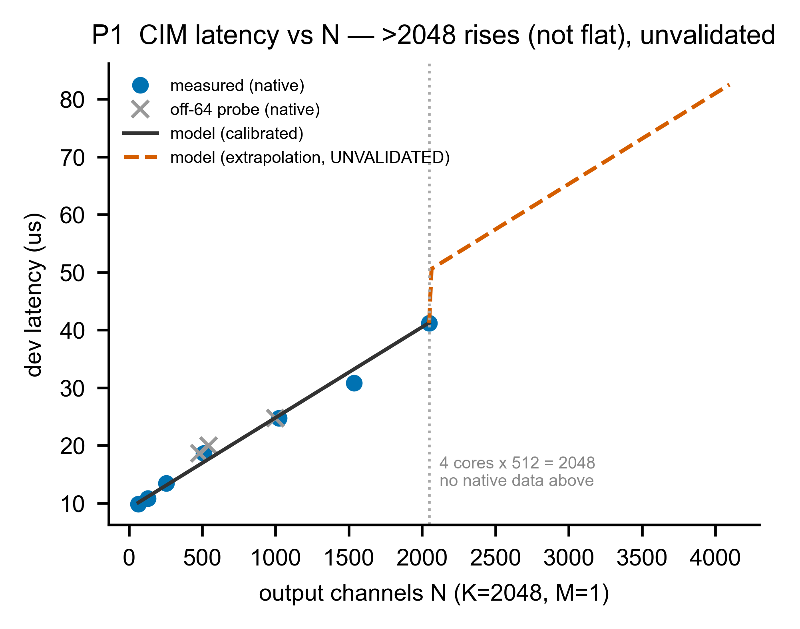
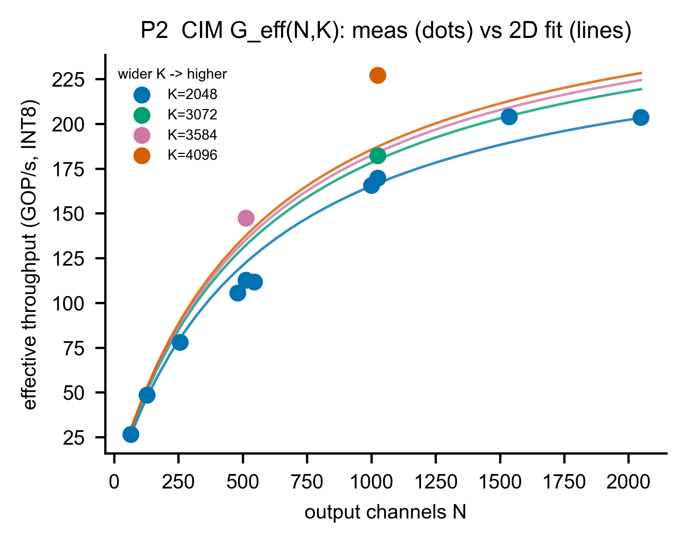
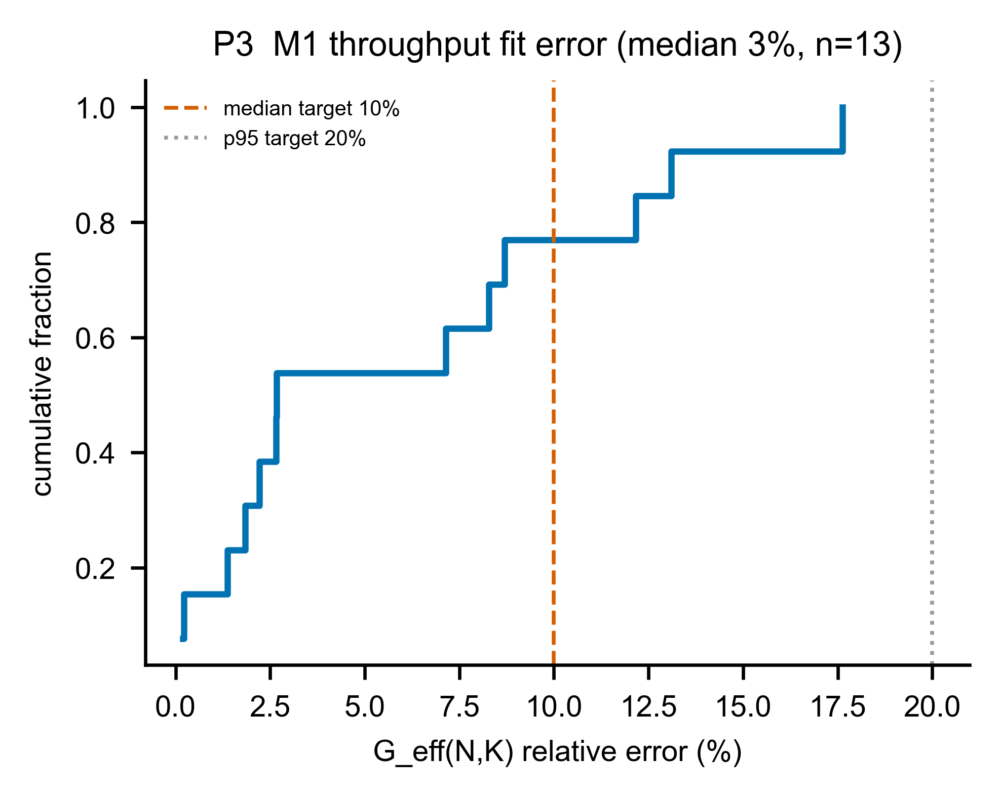

# A1 — M1：CIM tile 時間模型（系統的主角）

> **這一章你會學到**：Metis 的 CIM 在硬體上長什麼樣（**四核、每核 512×512**）、它怎麼算一次矩陣乘法、我們的模擬器為什麼以「**n 個 core**」為最小單位、吞吐怎麼隨輸出寬 N 和輸入深 K 變化、以及——**哪些是真量測、哪些是我們公式外推出來的**（這一版把所有「沒量到卻給數字」的地方都改掉了）。

> **修訂說明（重要）**：這一章對照了 Metis AIPU 的 ISSCC 2024 論文（[筆記](../../../../papers/metis-silicon/metis-aipu-isscc2024.md））後做了大幅更正。前一版有幾個真錯誤：把「2048×2048 crossbar」當單一陣列（其實是 **4 核 × 512×512**）、用 GFLOP/s（其實是 INT8 的 **GOP/s**）、把外推點 N=3072 當量測、把 K 效應說成「不可擬合」。以下都修正了。

---

## A1.1 架構考量：CIM 在系統裡是誰？硬體長怎樣？

M1 是 6-box 架構（§0.7）裡的 **CIM 那一格**，是主力計算單元，負責 weight-stationary 矩陣乘法（Q/K/V/O 投影、FFN 的三個 matmul、lm_head）。

**硬體（ISSCC 2024 論文）**：Metis 是一顆 **quad-core（4 個 AI-Core）** 的晶片，每個 core 內有一塊 **512×512 的 INT8 數位 in-memory（D-IMC）crossbar**（由 16 個 bank 組成，每 bank = 512 input × 32 output × 4 weight-set）。4 核合計峰值 209.6 TOPS。

**我們的模擬器以「n 個 core」為最小單位**（n 是可調參數）：

- 單核原語 = 512×512。
- n 核合併的**有效輸出寬度 = n × 512**。對 Metis，**n=4 → 有效寬 2048**。
- 我們的量測用的是**預設 compile**（沒指定 `--aipu-cores`，也沒記下 cores-spanned），而觀測到的 tile 邊界**剛好 = 2048 = 4×512**，這強烈指向**預設用了全部 4 個 core**（單一 instance 跨 4 核的低延遲映射）。所以**我們擬合的公式是「n=4 的整顆晶片」**，不是單核。（嚴格確認 cores-spanned 要上板看 `.../<N>/model.json`，但板子目前離線。）

**M1 要回答**：給形狀 `(M,K,N)`，這顆（n=4）CIM 算它的 **device 計算延遲（µs）** 是多少？（host↔device 的 911µs 來回成本是 **M2／A2** 的事，不在這裡。）

---

## A1.2 原理：兩個維度怎麼影響速度

decode 時 M=1（GEMV）。一次矩陣乘法 `[1,K]×[K,N]` 有兩個維度：

- **N＝輸出通道數**（要算幾個輸出）。
- **K＝輸入深度**（每個輸出要累加幾個乘加）。

**輸出是「一次 64 個」地產生的**（這解釋了「channel-64」這個詞）：論文說整數運算單元**每個 cycle 吐 64 個 INT32 輸出**，輸出組織成 8×64=512、gating 粒度 32。所以延遲會在 **N 為 64 的倍數**處有小階梯——這就是「channel-64 staircase」。我們特意測了 3 個**非-64**的 N（480/544/1000）去驗證對齊罰則：結果它們落在曲線上、沒有明顯懲罰，代表 64-量化效應很輕微。

**有效吞吐 `G_eff` 同時隨 N 和 K 上升**（不是只看 N）。直覺：N 大、K 大都讓引擎「填得更滿」、固定 overhead 被攤平，吞吐就高。實測（INT8、GOP/s）：

| 固定 N | K=2048 | K=3072 | K=3584 | K=4096 |
|---|---|---|---|---|
| N=512 | 112.6 | — | **147.4** | — |
| N=1024 | 169.8 | 182.3 | — | **227.2** |

→ **同一個 N、K 越寬、吞吐越高**（這就是後面要 fit 的「K 效應」）。

**device envelope（能配置多大）— 為什麼是 6M，不是 32 MB L2？**
實測探出 `K·N ≲ 6M` 參數可配置（6.3M OK、8.4M 失敗 `zeMemAllocDevice`）。這個 6M **既不是 32 MB L2、也不是 52 MiB 片上 SRAM**——關鍵在於 **Alpha 板沒有真正的 on-card DRAM**：

- `zeMemAllocDevice` 配置的「device 記憶體」，在 Alpha 上其實是一塊**把 host LPDDR 映射進裝置位址空間的 PCIe-IOMMU window**（不是真 DRAM；voyager-sdk.md `[MEASURED]`）。
- 而這個 window **預設只有 ~14 MB**（Axelera 論壇 SMMU-v3 thread #1330，可經 device-tree 擴到 128 MB／1 GB；voyager-sdk.md:248）。
- 6.3M 參數（≈6 MB 權重）＋ 活化／workspace 剛好逼近這 ~14 MB → 8.4M 就配不下。

所以 **6M ≈「預設 IOMMU window 的權重份額」**，跟 L2（32 MB，weights home 預設、>32 MB 才 spill）或晶片 SRAM 容量無關。（嚴格確認那次 run 的 window 大小，要看板上的 `compile_config.json`／device-tree——板子目前離線，這條列為**證據鏈到此、待上板補確認**。）

---

## A1.3 參數設計：公式與 2D 擬合

延遲公式（`simulator/models/m1_cim_tile.py`）：

```
W = n_cores × 512                      # 有效輸出寬度（n=4 → 2048）
dev_lat(M,K,N) = Σ over 輸出 tiles（每塊寬 ≤ W）  2·M·K·n_tile / G_eff(n_tile, K)
G_eff(N,K) = Gmax · N/(N+Na) · K/(K+Kb)   # 2D 有效吞吐（GOP/s）
```

- **2D `G_eff(N,K)`**：在 **13 個原生單-tile 點**上擬合，得 **Gmax=333.7 GOP/s、Na=577、Kb=574**。這條公式**同時吃進 N 和 K**——所以前一版那個「寬-K 不可擬合」的說法是錯的，K 效應是可以擬合的（見 P2）。
- **沿 N 分塊、連續上升**：當 N 超過一個 tile 寬（>2048）就切多塊，每塊**按自己的大小計費**——所以延遲是**持續往上**，不是前一版那種「跳到 2 倍再變平」。（一個只用一小段的第二塊，因為塞不滿、吞吐低，會帶一點開銷，所以 N 剛過 2048 時有一小跳，之後續升。）

> **單位更正**：Metis 是 INT8 整數引擎 → 吞吐是 **GOP/s（giga-OPS）**，不是 GFLOP/s。本章已全部改正（issue #18）。

---

## A1.4 Measurement vs Prediction（誠實版）

**先講清楚什麼有量、什麼沒量。** decode 投影（proj_decode）共 16 個形狀，但**只有 5 個是原生量測**（N≤2048、K·N≤4.19M，能配置進裝置），**其餘 11 個 N 或 K 太大、超過 envelope，根本沒量到**——它們的「值」是**我們公式 tile-sum 算出來的**，不是量測。所以這一版**不再把那 11 個列成「量測 vs 預測、誤差 0%」**。

**（A）原生量測的 proj_decode（5 個，這才是真的「量測 vs 預測」）：**

| 模型 | 投影 | K | N | 量測 µs |
|---|---|---|---|---|
| 1B | q_o | 2048 | 2048 | 41.2 |
| 1B | kv | 2048 | 512 | 18.6 |
| 3B | kv | 3072 | 1024 | 34.5 |
| 8B | kv | 4096 | 1024 | 36.9 |
| Qwen | kv | 3584 | 512 | 24.9 |

**（B）沒有量測、由公式 tile-sum 合成的（11 個，標明無量測）：** 1B/3B/8B/Qwen 的 q_o（大）、gate_up、down——這些 K·N 從 9.4M 到 68M，**全部 > 6M envelope，沒辦法在裝置上量**。它們的延遲是模型輸出（165–824µs），**不是量測值，不該當驗證**。

**真正的擬合驗證在「吞吐」上**（13 個原生單-tile 點）：

- **`G_eff(N,K)` 擬合誤差：中位數 2.7%、p95 14.9%、max 17.6%** → 過門檻（median ≤10%、p95 ≤20%）。
- 由吞吐導出的**原生延遲**誤差：中位 2.7%、max 21%。
- **多-tile 唯一的原生點**（N=4096, K=1024 = 37.1µs，這是唯一 N>2048 還能配置的原生點，因為 K=1024 小）：模型預測 **50.3µs（+36%，偏高）**。代表**我的連續分塊外推偏悲觀**（真實硬體在多塊時 pipeline 得更好），這點誠實標為「外推、偏高、未充分驗證」。

---

## A1.5 K 效應是可以擬合的（更正前一版）

前一版說「寬-K 幫助吞吐只有 8B kv 一個點、不能擬合」——**這是錯的**。實際有 **13 個原生點橫跨 N 與 K**，固定 N 就能看到 K 效應（上表：N=512 時 K2048→112.6、K3584→147.4；N=1024 時 K2048→170、K4096→227），而且 aspect 點顯示它**對稱**（N1024·K4096 = N4096·K1024 = 227）。我已改用 **2D `G_eff(N,K)`** 把 K 一起 fit 進去（P2 是它的對比圖）。殘留：高-K 角落（如 8B kv 的 227）公式仍略微低估（P2 看得到那顆點在線上方），這個殘差**據實呈現**、不再藏。

---

## A1.6 圖片解釋

**圖 A1-1（P1）— 延遲 vs N（K=2048）：原生 + 外推**


- **X**：輸出通道 N。**Y**：device 延遲（µs）。
- **藍點 = 原生量測，灰 × = 非-64 探測點**。**黑實線 = 校準範圍（N≤2048）的模型**。**橘虛線 = N>2048 的外推（UNVALIDATED）**。
- **怎麼看**：N≤2048 模型貼合量測；過了 2048（=4 核×512、無原生資料）後**虛線持續上升**（不是前一版的平移），並明確標「未驗證」。**前一版被你抓到的假 N=3072 量測點已移除。**

**圖 A1-2（P2）— 2D 有效吞吐 `G_eff(N,K)`：量測 vs 擬合**


- **X**：輸出通道 N。**Y**：有效吞吐（**GOP/s**，INT8）。**顏色 = 不同 K**。
- **點 = 量測，線 = 2D 擬合**。
- **怎麼看**：同一個 N，**K 越大（顏色越暖）吞吐越高**——這就是 K 效應，而且被公式抓到。橘色 K=4096 在 N=1024 那顆點（227）落在自己擬合線上方，誠實反映公式對高-K 角落略低估。

**圖 A1-3（P3）— `G_eff` 擬合誤差分佈**


- **X**：`G_eff(N,K)` 相對誤差（%）。**Y**：累積比例。垂直線為 10%/20% 門檻。
- **怎麼看**：曲線整體落在門檻左側（中位 2.7%），但有少數點接近 15–18%（高-K 角落），這些都在圖上、沒有被平均蓋掉。

---

## A1.7 限制與 gap（誠實清單）

| 項目 | 狀態 | 說明 |
|---|---|---|
| 單-tile 吞吐 `G_eff(N,K)` | ✅ 已擬合驗證 | 13 個原生點，中位 2.7%、p95 14.9% |
| 多-tile（N>2048 / K·N>4.19M） | ❌ 未驗證 | 只有 1 個原生多-tile 點；模型偏高 +36%；連續上升外推、明標 unvalidated |
| proj_decode 大形狀（11 個） | ❌ 無量測 | K·N>6M envelope，裝置量不到；值為模型 tile-sum，非量測 |
| n_cores | ⚙️ 參數化 | 最小單位=單核 512；n 可調；本次校準在 **n=4**（cores-spanned 待上板確認） |
| 單位 | ✅ 已更正 | GOP/s（INT8），非 GFLOP/s |
| compute ceiling | 📌 未建模 | 量到的 ~227 GOP/s 只有峰值 209,600 GOP/s 的 0.1%；decode 不碰天花板（issue #16） |
| 64 對齊 | ✅ 已解釋 | 64 outputs/cycle、8×64 輸出組織；非-64 點無明顯罰則 |
| device envelope | ⚠️ 證據到 IOMMU window | 6M ≈ 預設 PCIe-IOMMU window（~14MB，forum #1330）的權重份額（Alpha 無真 on-card DRAM）；**非** L2(32MB)/SRAM；確切 window 大小待上板看 `compile_config.json` |
| 板子離線 | ⛔ 無法補量 | 多-tile / >2048 / 大形狀都無法再量；只能外推並標未驗證 |

**一句話總結 A1**：Metis CIM 是**四核、每核 512×512** 的 INT8 D-IMC；我們以「n 核」為最小單位（n=4）建模，有效吞吐 `G_eff(N,K)` 隨 N 與 K 上升、在 13 個原生點上擬合到中位 2.7%；**但只有單-tile（≤一塊）有量測**，更大的形狀全是外推、誠實標未驗證（連續上升，不再平移，也不再把外推點當量測）。下一章 A2 處理「搬資料」那一半。
