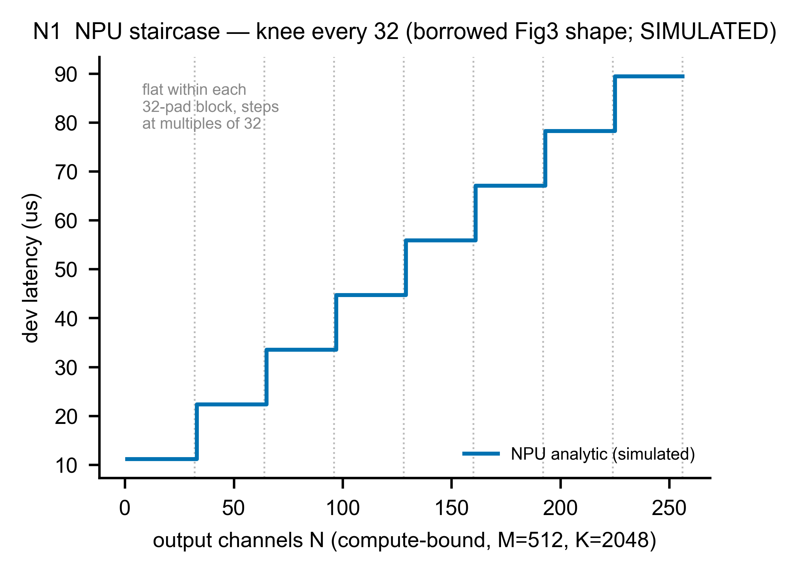
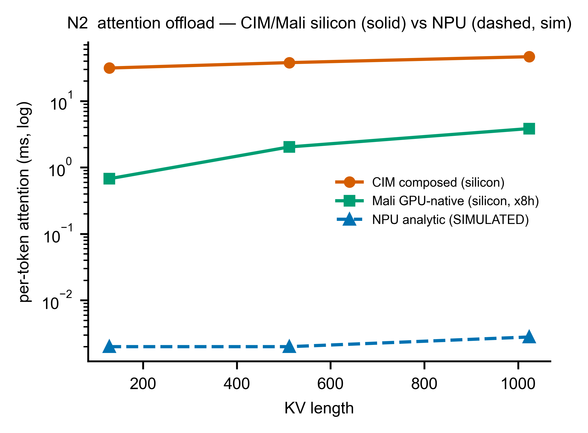

# N — M4-NPU：RKNPU2 解析 systolic-roofline（**全模擬，無 silicon**）

> **這一章你會學到**：為什麼這一整章的 NPU 數字**沒有一個**是量出來的、我們怎麼用一個「6 TOPS 天花板 + 借來的 32×32 對齊 + order/shape 罰則」的解析模型把 RKNPU2 補成模擬器裡一個**可換的槽**、這個模型的形狀為什麼能對上 HeteroInfer 的三條趨勢（Fig3 階梯 / Fig4 order/shape / Fig5 頻寬），以及為什麼「對上形狀」**不等於**「校準到 silicon」。

---

## N.1 架構考量：NPU 是誰？為什麼這章全是模擬？

異質 SoC 的第三顆計算單元是 **NPU**（RK3588 上的 RKNPU2，一個 systolic-array 加速器，和 Hexagon 同類）。在 CIM-centric 的設計裡，它是 compute-bound matmul 的候選承載者——HeteroInfer（SOSP'25）量到「**NPU ≫ GPU for matmul**」，把 Matmul/FFN-down 丟給 NPU、RMSNorm/SwiGLU 丟給 GPU。

**但我們手上沒有 RKNPU2 silicon。** aetina 板在 Phase 0.3 期間離線（issue #13），RKNPU2 的 matmul/attention micro-benchmark **從未採集**。所以本章和 Phase 1.1 的 CIM/Mali 章節有一個**本質差別**：

| | 資料來源 | 誠實標籤 |
|---|---|---|
| CIM（M1）、Mali（M4-GPU） | 我們自己的 silicon 量測 | **calibrated** |
| **NPU（M4-NPU，本章）** | datasheet + HeteroInfer 借來的趨勢 | **simulated / borrowed** |

**這章的每一個數字都是 `simulated` 或 `borrowed`，沒有一個是 calibrated。** 它存在的唯一理由，是讓異質模擬器有一個**可換的 NPU 槽**——等 silicon（#13）救回、或 Phase 1.3 接上 ONNXim，這個槽會被**取代**，而不是被「驗證」。

---

## N.2 原理 + 參數：解析 systolic-roofline

模型（INT8 GEMM，M×K×N）由四個項組成，全部來自 datasheet 或借來的趨勢：

```
padded_MACs = ceil(M/sd)·sd × ceil(K/sd)·sd × ceil(N/sd)·sd      # sd = 借來的 32×32
compute_us  = 2·padded_MACs / (6 TOPS) × order_shape_factor      # 6 TOPS = datasheet
memory_us   = weight_bytes / eff_BW                              # eff_BW = Fig5 帶
latency_us  = max(compute_us, memory_us, dispatch_floor)
```

- **對齊 padding（borrowed 32×32）**：systolic array 是固定大小的方陣；任何不是 32 倍數的維度都要**補滿一整排/一整列**，那些補出來的 MAC 是浪費。`sd=32` **借自 Hexagon**（HeteroInfer §3.2 Fig3），標 `borrowed`。這就是 §N.3(a) 的**階梯**來源。
- **compute 天花板（6 TOPS INT8）**：RKNPU2 datasheet 峰值，標 `assumption`。
- **order/shape factor（≤6×）**：當輸入 activation 相對權重很寬（大 N:K），就破壞了 weight-stall paradigm，吞吐掉到 GPU 等級——HeteroInfer §3.2 Fig4 量到**最多 6×**。我們用一個 [1, 6] 的乘數隨 log₂(N/K) 線性上升、在借來的 6× 飽和，標 `borrowed`。
- **memory 天花板**：權重串流 `bytes / eff_BW`，`eff_BW` 取 Fig5 帶的下緣（pessimistic）。
- **dispatch floor**：一個小的固定 per-op 開銷，標 `assumption`（無 silicon → 名目值）。

**native attention（`attn_bmm`）**：activation×activation，沒有靜態權重可 stall → 純 compute-bound（QK^T + S·V，padded 到 32，無 order/shape 罰則、無權重串流）。

**dtypes 限制**：只支援 **INT4/8/16 + FP16**（datasheet；無 BF16/TF32）。**無 RKNPU2 power telemetry → 能耗不可判**（這章不報任何 energy 數字）。

---

## N.3 模擬 vs 參考：三條趨勢勾稽（**這就是驗收**）

**沒有 silicon ⇒ 沒有數值 gate。** 不存在「median ≤10% / p95 ≤20%」這種 per-op 誤差門檻——因為沒有真值可比。**唯一的驗收是「形狀」對得上 HeteroInfer 的借來趨勢**。三條都標 `simulated`，量化結果寫在 `validation/reports/phase1.2/m4_npu.json`：

### (a) Fig3 階梯：knee 落在借來的 32×32

`tools/analysis/build_m4_npu.py` 在 compute-bound 區（M=512, K=2048）掃 N=1…256，驗：(i) 延遲**單調不減**、(ii) 每個 32-pad block **內部水平**、(iii) **每一階都落在 32 的倍數**。量化結果：`monotone=True、7 個 knee、全部對齊 32`。

**圖 N1（NPU 階梯 vs Fig3 形狀）— SIMULATED**


- **怎麼看**：藍階梯在每個 32-block 內**完全水平**，到 N=33、65、97… 就**跳一階**——這是 systolic array「不是 32 倍數就浪費一整排」的直接後果，形狀對上 Fig3。
- **誠實邊界**：這是借來的**形狀**，不是 Fig3 的絕對值（我們沒有 Fig3 的數字、也沒有 RKNPU2 silicon）。階梯的**高度**由 6 TOPS 推得（assumption），不是量出來的。

### (b) Fig4 order/shape ≤6×

order/shape 乘數在一個寬到 N=K·64 的 aspect 掃描上，**最大值 = 6.00 ≤ 6**（對上 Fig4 的「最多 6×」上限）。標 `simulated`。

### (c) Fig5 頻寬 59–66%（分母=68）

有效頻寬帶 = **68 GB/s 峰值的 59–66%**（Fig5 量到 single-proc decode 40–45 / 68）。**這個 59–66% 的分母是 68，不是 RK3588 的 ~34 host BW**——這點在 spec 和報告裡都標明（RKNPU2 的絕對帶 34×frac 另存）。量化：`frac_low=0.59、frac_high=0.66`，落在 [0.59, 0.66]。標 `simulated/borrowed`。

### attention offload：NPU 是模擬、CIM/Mali 是 silicon

**圖 N2（attention offload）— CIM/Mali 實線=silicon，NPU 虛線=SIMULATED**


- **CIM composed（橘，實線）**、**Mali GPU-native（綠，實線）**：Phase 1.1 的 **silicon** deliverable。
- **NPU analytic（藍，虛線）**：本章的解析估計，**畫成虛線 + 標 SIMULATED**，讓誠實邊界一眼可見。
- **⚠️ 重要誠實標註**：NPU 的**絕對值**（落在 CIM/Mali 之下約三個數量級）是 6 TOPS 解析天花板的直接輸出——attention 的 FLOPs 對 6 TOPS 來說極小，所以模型算出很快。這**和 HeteroInfer「NPU ≫ GPU for matmul」的方向一致**，但**絕對值未經 silicon 驗證**，只能當趨勢方向、不可當校準延遲。要把它變成可信的絕對數字，得等 #13 silicon 或 Phase 1.3 ONNXim。

---

## N.4 升級路徑：#13 silicon vs ONNXim（兩件不同的事）

| 升級 | 是什麼 | 狀態 |
|---|---|---|
| **issue #13 silicon** | 真實 RKNPU2 板的 matmul/attention micro-benchmark | **superseded-not-satisfied**：未採集（板離線）。本解析模型**取代**它成為 Phase-1.2 deliverable，但**沒有達成**那個 silicon gate。#13 的 median/p95 silicon gate 記為 **superseded-not-satisfied**（ADR-0006 gate 修訂）。 |
| **ONNXim（Phase 1.3）** | 一個通用 systolic NPU **模擬器**，接到同一個 `engine=` 介面後、對這些 HeteroInfer 趨勢交叉驗證 | **simulated，不是 silicon**。 |

**關鍵區分**：#13 = 真 RKNPU2 **silicon**（缺席）；ONNXim = 更重的**模擬器**（Phase 1.3），**仍然不是 silicon**。**兩者都沒有校準到我們的 RKNPU2 板。** 合約 `validation/contracts/m4_npu.yaml` 已從 `BLOCKED` 改為 `SIMULATED`，並明寫「無 per-op 數值 gate、驗收=三條 trend-shape 勾稽、#13 silicon gate=superseded-not-satisfied」。

---

## N.5 限制與 gap（誠實清單）

| 項目 | 狀態 | 說明 |
|---|---|---|
| 全部數字 | 🟡 simulated/borrowed | 6 TOPS + dtypes（datasheet）、32×32（Hexagon 借）、BW 帶（Fig5 借）；**沒有一個 fit 到 RKNPU2 silicon** |
| 數值 gate | ❌ 無 | 無 silicon → 無 per-op median/p95 門檻；驗收=trend-shape 勾稽 |
| #13 silicon | ⚠️ superseded-not-satisfied | 板離線、micro-benchmark 未採集；解析模型取代非達成（ADR-0006） |
| NPU 絕對延遲 | ⚠️ 未驗證 | order/shape 與階梯**形狀**對上 Fig3/4/5；**絕對值**未經 silicon，只當趨勢方向 |
| dtypes | ✅ 已界定 | 只 INT4/8/16 + FP16（無 BF16/TF32） |
| 能耗 | ❌ 不可判 | 無 RKNPU2 power telemetry |

**一句話總結 N**：RKNPU2 在本期是一個**全模擬**的解析 systolic-roofline（6 TOPS 天花板 + 借來 32×32 padding + ≤6× order/shape + Fig5 頻寬帶 + native attn bmm），它的**形狀**對得上 HeteroInfer 的三條趨勢（這就是 SIMULATED 驗收），但**沒有任何一個數字校準到 silicon**；#13 silicon = superseded-not-satisfied，ONNXim 是 Phase 1.3 的更重模擬器、仍非 silicon。
