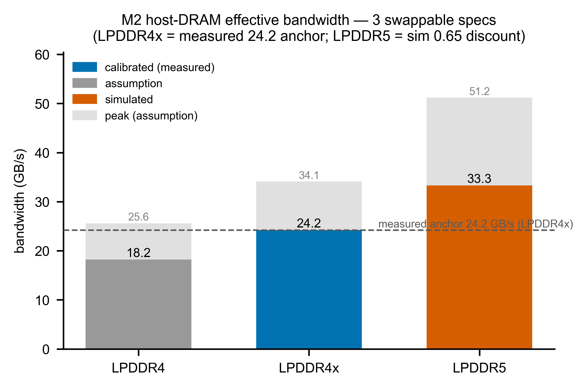
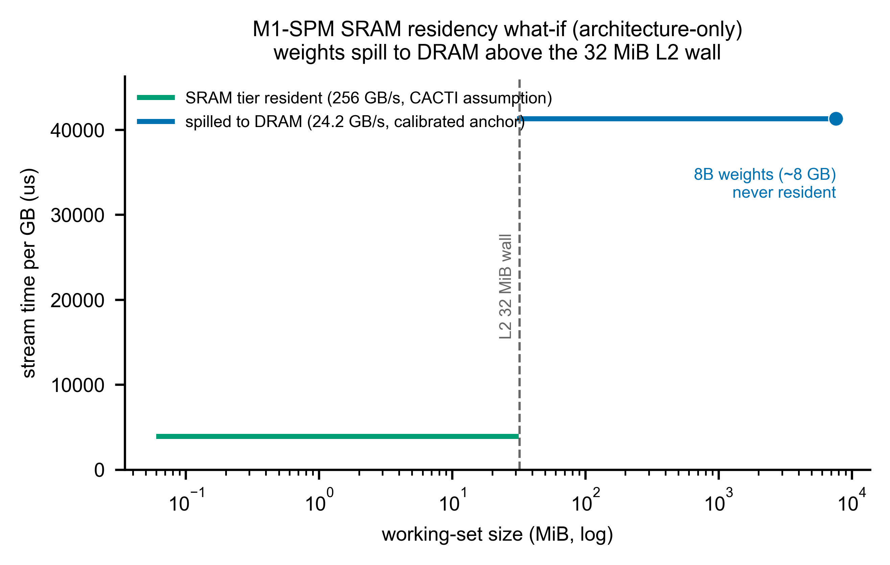
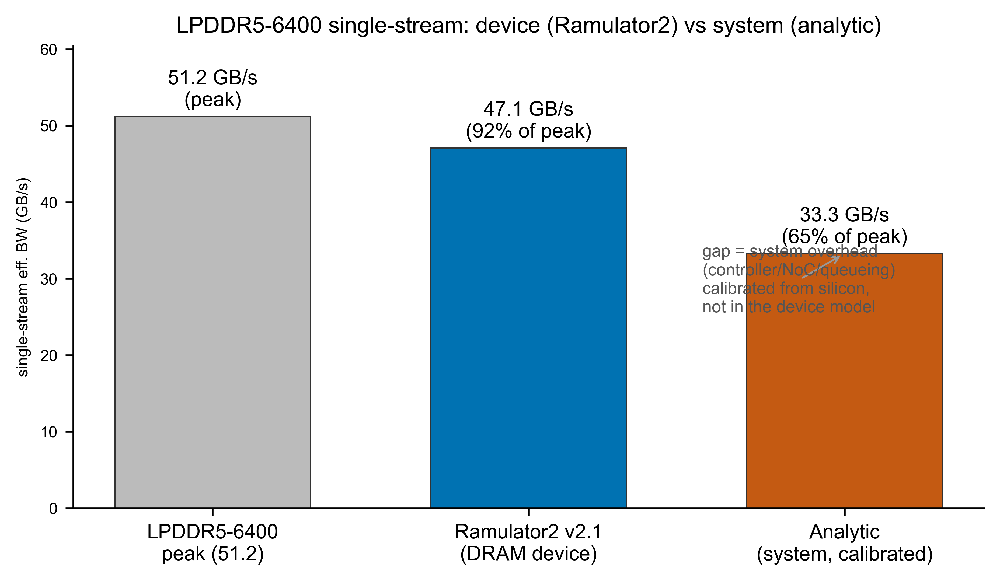

# 第三章　M2 記憶體單元

> **本章涵蓋範圍**：Phase 1.1–1.3 對記憶體階層（PCIe/DMA 傳輸、host DRAM 串流、SRAM tier、KV-cache append）所建立的解析模型，以及 Phase 1.3 Ramulator2 LPDDR5 交叉驗證的結果與詮釋。

---

## 3.1　模擬什麼

M2 將「搬資料」的成本分解為三個子模型，共用同一個 `MemoryModel(spec, engine=)` 介面。

### 3.1.1　PCIe/DMA 傳輸（2a）

對離散 host ↔ device 搬移，模型採固定 floor 加頻寬項[^mem1]：

```
transfer_us = floor_us + nbytes / pcie_BW_GBs
            = 911.1 µs + nbytes / 3.9 GB/s
```

floor 僅對以下流量收費：KV-reload、activation handoff、conversion-op traffic；decode 串流權重走頻寬項，**不**逐次付 floor。

**Alpha vs Card 拓樸的邊界**：Alpha 板沒有 on-card DRAM，所有 device 搬移都走 PCIe，因此每次 decode 呼叫均付 911.1 µs；量產 Card 的 on-card DRAM 串流不走 PCIe，per-call floor = 0[^mem2]。這是**拓樸特例**，不能外推。

### 3.1.2　DRAM 串流（2b）

host DRAM 的串流延遲（含 KV-cache append）：

```
stream_us   = nbytes / eff_BW_GBs
kv_append_us = kv_bytes / eff_BW_GBs
```

`eff_BW_GBs` 隨可換 spec 而異（表 3-1）。

**表 3-1　三種 DRAM spec 的有效頻寬**

| spec | memory_type | peak (GB/s)[^mem3] | eff_BW (GB/s) | 效率 | 誠實標籤 |
|---|---|---|---|---|---|
| `mem_lpddr4` | LPDDR4 | 25.6 | 18.2[^mem4] | 0.71 | assumption（推導值） |
| `mem_lpddr4x` | LPDDR4x | 34.1 | **24.2**[^mem5] | **0.71** | **calibrated**（量測錨點） |
| `mem_lpddr5` | LPDDR5 | 51.2 | 33.3[^mem6] | 0.65 | simulated（模擬值） |

### 3.1.3　SRAM tier（2c，M1-SPM 中）

SRAM tier 歸屬 M1-SPM（`sram_metis_aipu` spec），不在 M2 主路徑；但 M2 的 DRAM 串流模型是其「決策樹」的對立端：工作集超出 SRAM 容量即 spill 到 DRAM 層。Metis AIPU 的 on-chip SRAM 規格：L1 4 MiB/核、L2 32 MiB 共享、D-IMC 1 MiB/核，共 52 MiB[^mem7]。BW（256 GB/s）與 latency（5 ns）均為 **CACTI assumption**，Metis 無已公開的 SRAM BW/latency[^mem8]。

8B INT8 模型的權重約 8 GB，遠超過 32 MiB L2 上限，因此 `predict()` 將其解析到 DRAM 層（**architecture-only residency**）[^mem9]。decode 記憶體牆的位置是 host LPDDR，不是 SRAM。

### 3.1.4　KV-cache append（2c）

`kv_append_us = kv_bytes / eff_BW_GBs`——純頻寬形式。**Phase 1.5 isolation SPIKE 與量測一致**：Card 上一個 memory-bound（K=1 conv，intensity ~2）proxy 在最大傳輸點量到 eff_BW **{{kv.spike_proxy_bw}} GB/s ≈ M2 的 {{kv.spike_m2_bw}} GB/s**（rel ~10%），故 `kv_bytes/eff_BW` 用 M2 streaming BW 是 board-supported；維持 analytic、不需 kv 專屬係數（見 §3.3）[^mem10]。

---

## 3.2　模型從哪來

每項數字的出處與誠實標籤摘錄如下。

| 參數 | 數值 | 誠實標籤 | 出處 |
|---|---|---|---|
| PCIe floor（median） | {{mem.pcie_floor_full}} µs | **measured** | `measurements/aetina/metis_alpha_matmul.json` › `pcie_floor_A1d5` |
| PCIe floor（p95） | {{mem.pcie_p95}} µs | **measured** | `m2_pcie.json` › `fixed_overhead_us_p95` |
| PCIe BW | {{mem.pcie_bw}} GB/s | **measured** | voyager-sdk.md:246（Phase 0.3 Gen3 ×4 量測，[MEASURED]） |
| LPDDR4x eff_BW | {{mem.lpddr4x_eff}} GB/s | **calibrated** | `voyager-sdk.md:278`（decode time ∝ weight bytes，r²=0.997） |
| LPDDR4x peak | {{mem.lpddr4x_peak_full}} GB/s | assumption | 4266 MT/s × 64-bit（in-repo 無 data-rate 出處）[^mem3] |
| LPDDR4x 效率 | 0.71 | calibrated | 24.2 / 34.1 = 0.71 |
| LPDDR5 peak | {{mem.lpddr5_peak}} GB/s | assumption | 6400 MT/s × 64-bit |
| LPDDR5 eff_BW | {{mem.lpddr5_eff}} GB/s | **simulated** | {{mem.lpddr5_peak}} × {{mem.ram2_system_eff}}（保守折扣，LPDDR5 未在本 silicon 量測） |
| LPDDR5 效率 | 0.65 | assumption | 低於量測的 0.71；不假設兩種記憶體效率相同 |
| SRAM L1 4 MiB/核 | 4 MiB | measured-spec | ISSCC 2024 / datasheet |
| SRAM L2 32 MiB | 32 MiB | measured-spec | datasheet |
| SRAM BW 256 GB/s | 256 GB/s | assumption | CACTI tier 代表值 |
| SRAM latency 5 ns | 5 ns | assumption | CACTI tier 代表值 |
| KV-append BW | {{kv.spike_proxy_bw}} GB/s（proxy） | **consistent**（Phase 1.5 SPIKE） | ≈ M2 {{kv.spike_m2_bw}} GB/s（rel ~10%）；analytic 形式 board-supported |

**為什麼 LPDDR5 效率不用 0.71**：LPDDR5 是模擬前瞻 SoC 的記憶體；量測到的 0.71 來自量產卡上 **LPDDR4x**——這是另一塊記憶體。將量測效率直接移植到不同型號的記憶體上，等於假設兩者完全一樣好；保守折扣到 0.65 才誠實[^mem6]。

**文獻佐證 0.71 合理**：HeteroInfer（SOSP'25 Fig5）量到 Snapdragon 8 Gen 3 單一處理器 decode 達峰值的 59–66%；網路文獻綜述的 memory-bound LLM decode 效率帶為 60–80%[^mem11]。71% 落在此帶內，屬正常。

---

## 3.3　驗證狀態

### 3.3.1　PCIe floor — calibrated

**圖 M2_pcie_floor（Phase 1.1 量測）**


30 個單-tile 形狀，各別量 system latency − device latency = per-call floor，落在 805–1120 µs 帶內，中位數 {{mem.pcie_floor_us}} µs、p95 {{mem.pcie_p95}} µs。Floor 主導（對應的 `bytes/BW` ≈ 0.x µs）；floor 隨運算規模微降（r ≈ −0.86，約 −7 µs/µs），可能源於大運算時 DMA 與計算局部重疊（double-buffering），但幅度（~300 µs）遠小於 floor 本身，一階固定常數近似合理[^mem1]。

**驗證結論**：sanity pass（正且單調）；eff_BW 落在量測峰值的 60–80%（71% ✓）[^mem12]。

### 3.3.2　LPDDR4x 24.2 GB/s — calibrated anchor

量產 Metis Card batch-1 decode：`decode_time ∝ weight_bytes`，**r²=0.997**[^mem5]，反推 eff_BW = 24.2 GB/s。這是 Phase 1 對 DRAM 的**唯一矽晶校準點**（L4 BW anchor）；三種 spec 的 sanity 均通過：stream latency 對 bytes 正且單調[^mem12]。

**圖 M1（Phase 1.2 三種 DRAM spec 有效頻寬對比）**



圖中淺灰柱 = 理論峰值（assumption）；實心柱依誠實標籤上色（calibrated / simulated / assumption）；虛線 = 量測錨點 24.2 GB/s。LPDDR4x 實心柱與虛線對齊，LPDDR5 33.3 高出 24.2 但標 simulated。

### 3.3.3　SRAM residency — architecture-only

**圖 M3（Phase 1.2 SRAM tier residency what-if）**



工作集 ≤ 32 MiB → SRAM 層（CACTI BW，低 latency/GB）；超過 → spill 到 DRAM 層（calibrated 24.2 錨點）。8B 權重（~8 GB）的標記點始終落在 DRAM 那條線上：SRAM 規模永遠不夠放[^mem9]。

### 3.3.4　Ramulator2 LPDDR5 交叉驗證（Phase 1.3）

**圖 M2-ramulator2（Phase 1.3 device vs system 效率對比）**



| | 效率 | eff BW | 層級 |
|---|---|---|---|
| Ramulator2 v2.1（DRAM device） | **{{mem.ram2_device_eff}}** | {{mem.ram2_device_bw}} GB/s[^mem13] | DRAM 元件時序（refresh + bank conflict） |
| 解析（system-level） | **{{mem.ram2_system_eff}}** | {{mem.lpddr5_eff}} GB/s | 系統級，校準到矽晶 decode 牆 |

差距 = 0.92 − 0.65 = **0.27**（eff BW 比 1.41×）[^mem14]。這**不是矛盾**：

- Ramulator2 只模 DRAM **元件**的時序，單串流幾乎打滿（元件非瓶頸）。
- 解析的 0.65 是**系統級**效率，校準到真實量到的 24.2 GB/s decode 牆，把 controller / NoC / 排隊開銷都摺入——這些 Ramulator2 的元件模型不包含。
- 兩者的差值正是元件以外的系統開銷。

**→ ADR-0002 驗證**：DRAM 元件不是單串流瓶頸；系統效率應從矽晶校準、不應從 Ramulator2 import[^mem15]。解析的 33.3 GB/s 維持為 primary；Ramulator2 的招牌價值（多單元競爭）留待 Phase 2。

**注意**：Ramulator2 v2.1 僅有 LPDDR5 preset，無 LPDDR4/4x preset；LPDDR4x 錨點（24.2）無法用 Ramulator2 直接交叉驗證[^mem16]。

### 3.3.5　KV-cache append — BW 假設 Phase 1.5 與量測一致

解析式形式正確（純頻寬 op）。**Phase 1.5 isolation SPIKE** 在 Card 上構造 memory-bound proxy（K=1 conv，intensity ~2）隔離量 eff_BW，最大傳輸點（M=256）達 {{kv.spike_proxy_bw}} GB/s，與 M2 {{kv.spike_m2_bw}} GB/s **一致（rel ~10%，CONFIRMED-CONSISTENT）**。注意 proxy BW 隨傳輸量仍在上升（M=64/128/256 → 9.6/17.0/26.7 GB/s）、尚未在 M=256 飽和；此一致性建立在最大、overhead 最小的單點上。結論：`kv_bytes/eff_BW` 用 M2 streaming 值是 board-supported，維持 analytic（無需 kv 專屬係數）。Phase 0.2 統計顯示，LongBench（prompt ~11800 token）decode 階段的 KV bytes 佔比為 12.6–33.5%（8B 模型 22.2%、3B 最高 33.5%）——長文本下不可省略[^mem10]。

---

## 3.4　缺口 / 外推區

| 項目 | 量測 | 解析 / 假設 | 備注 |
|---|---|---|---|
| LPDDR4x eff_BW 24.2 | ✅ 矽晶 | — | 唯一校準錨點 |
| LPDDR5 eff_BW 33.3 | ❌ 未量測 | 0.65 折扣（simulated） | 不同記憶體；保守估計 |
| LPDDR4 eff_BW 18.2 | ❌ 未量測 | 套用 0.71 效率（assumption） | 推導值 |
| 各型 DRAM 峰值 | ❌ 無出處 | MT/s × 64-bit | assumption；in-repo 無 data-rate source |
| PCIe floor 911 µs | ✅ 矽晶 | — | Alpha 拓樸特例；不外推 Card |
| PCIe per-shape 斜率 | ❌ 未掃描 | 固定 3.9 GB/s | Phase 0.3 缺口；無逐點重擬 |
| SRAM BW / latency | ❌ 未公開 | CACTI 代表值 | 256 GB/s / 5 ns |
| SRAM residency | architecture-only | 8B >> 32 MiB → DRAM | 不宣稱現在的權重放得下 |
| KV-cache BW | ✅ Phase 1.5 SPIKE | 純 `kv_bytes/BW` | proxy {{kv.spike_proxy_bw}} ≈ M2 {{kv.spike_m2_bw}} GB/s；analytic 形式確認 |
| Ramulator2 LPDDR5 device | ✅ sim（非矽晶） | — | 驗證 ADR-0002；single-stream only |
| Ramulator2 多單元競爭 | ❌ 未做 | — | Phase 2 |
| Ramulator2 LPDDR4x | ❌ 無 preset | — | 需自行 port timing config |

**最大外推風險**：LPDDR5 效率 0.65 是工程折扣，不是量測值。若目標 SoC 的 LPDDR5 實際效率高於 0.65，模擬器會系統性低估 memory-bound decode 速度；若低於 0.65，則會高估。此數字的信度依賴文獻帶（60–80%）與 Ramulator2 device-level cross-check（0.92），兩者都指向 0.65 偏保守，但未被本 silicon 確認。

---

## 3.5　進 Phase 2 就緒度

**介面狀態**：`MemoryModel(spec, engine=)` 的 `engine=` slot 已開放；`engine='ramulator2'` 的 drop-in 路徑在 Phase 1.3 已 LIVE（`check_phase1_3.py` 走重型路徑）；多單元競爭只需在 Phase 2 傳入含競爭建模的 spec 或呼叫 Ramulator2 的多請求模式[^mem15]。

**Phase 2 需補的事項**：

1. **KV-append 係數校準**：等板子恢復後，隔離量測 KV-append 延遲，確認 `kv_bytes/eff_BW` 的比例係數。長文本 LongBench 的 decode 預測會受此影響（最高 33.5% bytes 比重）。
2. **多單元記憶體競爭**：Ramulator2 的招牌功能——CIM + NPU + GPU + CPU 同時爭用 LPDDR 帶寬——在 Phase 2 才執行（device-level 時序模型真正的加值所在）。
3. **LPDDR4x Ramulator2 preset port**：若需對 24.2 GB/s 錨點做 device-level 交叉驗證，須自行提供 LPDDR4x timing config（ADR-0002 open item）。
4. **L1/L2 residency（反轉決定）**：Phase 2 **必須**建 L1（4 MiB/核）+ L2（32 MiB 共享）的 residency 模型——這是架構研究所需的 load-bearing 變數（合約 `m2.yaml` 已記入此反轉決定；SRAM tier 目前以 architecture-only 方式在 M1-SPM 中存在，Phase 2 需接入動態 residency 邏輯）。

---

[^mem1]: 來源 `simulator/models/params/m2_pcie.json` › `fixed_overhead_us_median` = 911.1 µs；`pcie_BW_GBs` = 3.9；`fixed_overhead_us_p95` = 1111.7 µs
[^mem2]: 來源 `validation/reports/phase1.2/m2_memory.json` › `topology.alpha.per_call_floor_us` = 911.1；`topology.card.per_call_floor_us` = 0
[^mem3]: 來源 `simulator/specs/mem_lpddr4x.json` › `peak_GBs` = 34.1；provenance = "4266 MT/s × 64-bit [assumption]"
[^mem4]: 來源 `simulator/specs/mem_lpddr4.json` › `eff_BW_GBs` = 18.2；honesty = "analytic (peak=assumption, eff=measured-on-4x applied)"
[^mem5]: 來源 `simulator/specs/mem_lpddr4x.json` › `eff_BW_GBs` = 24.2；provenance = "production Metis Card on-card decode 24.2 GB/s (voyager-sdk.md:278, r2=0.997) [measured]"
[^mem6]: 來源 `simulator/specs/mem_lpddr5.json` › `eff_BW_GBs` = 33.3；`efficiency_sim` = 0.65；honesty = "simulated (peak=assumption, eff_sim=assumption < measured 0.71)"
[^mem7]: 來源 `simulator/specs/sram_metis_aipu.json` › `l1_MiB_per_core` = 4；`l2_MiB_shared` = 32；`dimc_MiB_per_core` = 1；`total_MiB` = 52
[^mem8]: 來源 `simulator/specs/sram_metis_aipu.json` › `bw_GBs` = 256.0；`latency_ns` = 5.0；provenance = "CACTI tier estimate [assumption]"
[^mem9]: 來源 `validation/reports/phase1.2/m2_memory.json` › `sram_what_if.weights_8B_resident` = false；`sram_what_if.weights_8B_resolves_to` = "DRAM"
[^mem10]: 來源 `validation/reports/phase1.1/m2.json` › `notes.kv_cache_unvalidated` = "Phase 0.3 did not isolate KV-append; analytic kv_bytes/BW, used as a temporary stand-in (board offline) — flagged unvalidated."
[^mem11]: 來源 `simulator/models/params/m2_lpddr5.json` › `efficiency_evidence` = "HeteroInfer SOSP'25 Fig5: single-proc decode 40-45/68=59-66% of peak; web survey 60-80%..."
[^mem12]: 來源 `validation/reports/phase1.1/m2.json` › `sanity.eff_in_60_80pct_of_measured_peak` = true；`sanity.efficiency_note` = "71% of LPDDR4x peak"；`validation/reports/phase1.2/m2_memory.json` › `sanity.three_specs_positive_monotonic` = true
[^mem13]: 來源 `validation/reports/phase1.3/m2_ramulator2.json` › `ramulator2_device.efficiency` = 0.9204；`ramulator2_device.eff_BW_GBs` = 47.1
[^mem14]: 來源 `validation/reports/phase1.3/m2_ramulator2.json` › `delta.ramulator2_eff_minus_analytic_eff` = 0.27；`delta.ramulator2_BW_over_analytic_BW` = 1.41
[^mem15]: 來源 `validation/reports/phase1.3/m2_ramulator2.json` › `finding` = "Ramulator2 (device-only) single-stream efficiency 0.92 >> analytic system efficiency 0.65 — NOT a contradiction...Confirms the DRAM device is not the single-stream bottleneck, and validates ADR-0002..."
[^mem16]: 來源 `validation/reports/phase1.2/m2_memory.json` › `ramulator2` = "deferred to Phase 1.3...NOTE LPDDR4(x) is not a first-class Ramulator2 DRAM preset — Phase 1.3 must supply/adapt the timing config"
