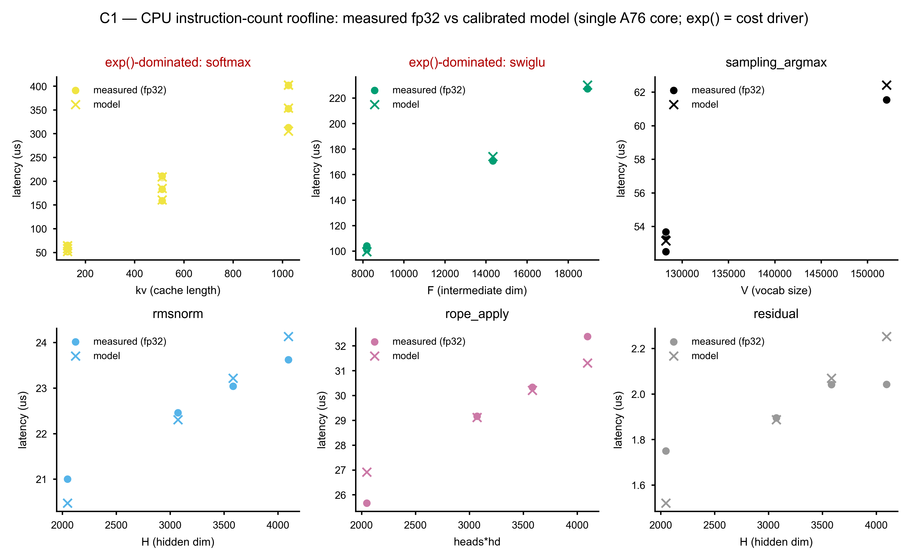
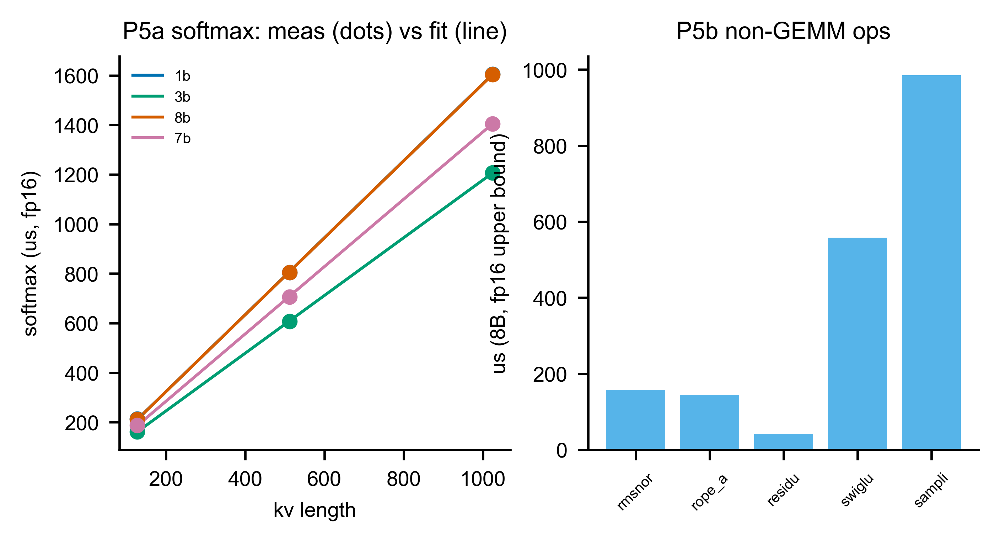

# 04 — M4-CPU：ARM RK3588 A76/A55 支援算子單元

---

## 4.1 模擬什麼

異質 SoC 裡，大型矩陣乘法（GEMM）交給 CIM/NPU，attention BMM 交給 GPU，但 LLM 推論每一層、每一個 token 還有六類**非 GEMM 的支援算子**必須跑：RMSNorm、RoPE 位置編碼套用（rope_apply）、殘差相加（residual）、FFN 閘控激活函數（swiglu）、attention softmax、以及詞彙表 argmax 取樣（sampling_argmax）。Profile 把它們全部指派給 **RK3588 的 CPU 叢集**（big.LITTLE：4×A76@2.3GHz + 4×A55@1.8GHz）。

M4-CPU 的任務是：給定一個支援算子與其尺寸，預測 **ARM A76（或 A55）單核或多核**在 decode 時的延遲。

### 4.1.1 Instruction-count roofline 公式

Phase 1.2（D1）將原來的量測查表（Phase 1.1）升級為**指令數 roofline**：

```
latency_us = max(compute_us, memory_us) + overhead_op

compute_us = (n_elem × ops_per_elem) / (Σ_assigned[W · IPC · freq]) / η_c

memory_us  = working_set_bytes / (BW_tier(working_set) × η_bw)
```

每一項的物理意義：

- **`n_elem`**：算子處理的元素數——softmax = `heads×(kv+1)`、swiglu = `F`（FFN 中間維）、sampling_argmax = `V`（vocab 大小）、rmsnorm/residual = `H`（hidden dim）、rope_apply = `heads×hd`。
- **`ops_per_elem`**：每個元素的等效浮點運算數（結構性假設，見下表）。`exp()` 是超越函數（transcendental），一次 `exp` 在 numpy fp32 上展開成約 30 個融合浮點運算，所以 softmax 與 swiglu 的 `ops_per_elem` 遠大於其他算子。這是**成本主因**，不是 reduction/elementwise 二分法[^cpu1]。
- **`Σ_assigned[W·IPC·freq]`**：指派核的 NEON 算力——單 A76 核 = 4 lanes × IPC 2 × 2.3GHz = 18.4 G lane-op/s[^cpu2]。多核即加總（外推）。
- **`η_c = 0.1521`**：numpy 實際達成峰值算力的比例，**對 fp32 cpu_ops.json 校準**（calibrated）[^cpu3]。
- **`BW_tier`**：依工作集大小（以單份拷貝計）選快取層——L1d（64KiB/核）→ L2（512KiB/核）→ L3（3MiB 共享）。Decode 支援算子的工作集全部落在快取層，**永遠不觸碰 host LPDDR**[^cpu4]。
- **`η_bw = 0.6`**：快取頻寬達成率，**assumption**（fp32 decode 資料中沒有任何純頻寬解析算子，repo 亦無 CPU mem-BW micro-benchmark；見 §4.4）[^cpu5]。
- **`overhead_op`**：每個算子的固定 dispatch 開銷（per-op 常數，校準），rmsnorm = 16.815µs、rope_apply = 22.525µs、residual = 0.789µs、sampling_argmax = 7.357µs、softmax = 15.497µs、swiglu = 0.0µs[^cpu6]。

### 4.1.2 Per-op 指令數參數（結構性假設）

| 算子 | ops_per_elem | byte_passes | 主要成本 |
|---|---|---|---|
| residual | 1 | 2 | 1 次加法 |
| rmsnorm | 5 | 4 | square/rsqrt/scale |
| rope_apply | 6 | 5 | 旋轉 pair 乘法 |
| swiglu | 34 | 3 | exp()（silu 閘） |
| softmax | 33 | 3 | exp()（機率歸一） |
| sampling_argmax | 1 | 1 | 1 次 compare |

[^cpu1]

memory 項的 `working_set_bytes` = `n_elem × bytes_per_elem × byte_passes`；快取**殘留大小**（用於選層）= `n_elem × bytes_per_elem`（單份拷貝，不乘 byte_passes）[^cpu7]。

---

## 4.2 模型從哪來

### 校準基準（calibrated）

`η_c`（= 0.1521）與所有 `overhead_op` 由 `tools/analysis/fit_m4_cpu_instrcount.py` 對 `measurements/aetina/cpu_ops.json` 擬合而來，量測條件：**單 A76 核、單執行緒、numpy fp32**，在 Aetina 板（RK3588）上執行[^cpu8]。

### spec 來源（measured / assumption）

| 欄位 | 值 | 標籤 |
|---|---|---|
| A76 4 核 @2.3GHz IPC=2 | RK3588 TRM | **measured** |
| A55 4 核 @1.8GHz IPC=1 | RK3588 TRM | **measured** |
| NEON 128-bit，fp32 4 lanes / fp16 8 lanes | ARMv8.2-A | **measured** |
| cache：L1d 64KiB/核、L2 512KiB/核、L3 3MiB | A76 TRM | **measured** |
| cache_bw：L1 73.6、L2 36.8、L3 18.4 GB/s（/核） | A76 TRM 推估 | **assumption** |

[^cpu2]

注意：`cache_bw_GBs` 是 A76 **自身 SRAM** 的 TRM 推估值，**不是** Metis AIPU 的 SRAM tier、**不是**量產卡的 LPDDR4x（24.2 GB/s）；WP-CPU 只依 `cpu_rk3588.json`，不依 WP-MEM[^cpu9]。

### FP16（analytic / simulated，非校準）

`dtype='fp16'` 路徑採**解析原生 fp16** 估計：`fp16_lanes=8`（= 2× fp32 NEON SIMD）+ 2-byte 元素，`η_c` 沿用 fp32 校準值。這是 **analytic** 估計，**非校準**。`cpu_ops.json` 的 fp16 量測值是 numpy 模擬（比 fp32 慢 ~4×），不代表原生 fp16，故 recompose 端到端路徑一律走 **fp32 校準路徑**[^cpu10]。

Phase 1.1 的 `m4_cpu.json` 儲存的 fp16 常數（例如 8B rmsnorm = 157.21µs、sampling_argmax = 985.52µs）是 numpy 模擬結果，可視為**保守上界**，已被 Phase 1.2 指令數 roofline 取代[^cpu11]。

### A55 與多核（simulated，外推）

校準基準僅單 A76 核單緒；多核路徑將核數加入 `Σ_assigned` 計算（外推），A55 設 IPC=1（單 NEON pipeline）。A55 與所有多核組態均為 **simulated**，未量測[^cpu12]。

### Prefill（analytic，未驗證）

本模型給出的是 **decode（1 token）成本**。Prefill 路徑為解析外推（fixed op × S、softmax S² 項），**完全未驗證**[^cpu4]。

---

## 4.3 驗證狀態

### Phase 1.2 門檻（fp32 A76 單核，instruction-count roofline）

校準依據：對 `measurements/aetina/cpu_ops.json`（fp32，4 個模型，單 A76 核）；acceptance criteria 定義於 `validation/contracts/m4_cpu.yaml`[^cpu3]。

| 算子 | 中位誤差 | 最大誤差 | bound |
|---|---|---|---|
| softmax | 0.81% | 2.37% | compute |
| swiglu | 1.87% | 4.30% | compute |
| sampling_argmax | 1.10% | 1.48% | compute + **memory**（qwen→L3） |
| rmsnorm | 1.45% | 2.51% | compute |
| rope_apply | 1.86% | 4.87% | compute |
| residual | 5.84% | 13.12% | compute |
| **整體** | **{{cpu.resid_median_pct}}%** | **{{cpu.resid_max_pct}}%**（p95 **{{cpu.resid_p95_pct}}%**） | |

門檻：中位 ≤10%、p95 ≤15%；兩項均通過[^cpu3]。

**圖 04-1（Phase 1.2 校準圖，C1）— 6 個算子量測 vs roofline**



X 軸為各算子的尺寸變數，Y 軸為延遲（µs，fp32）。實心圓 = 量測中位數（4 個模型各一點）；× = roofline 預測。softmax 與 swiglu 均以 `exp()` 主導，兩者斜率一致（約 12 ns/elem），驗證了「transcendental 是成本主因」的結構假設。sampling_argmax 的 qwen（V=152K，工作集 594KiB）超過 L2、落入 L3，為圖中唯一走 memory 分支的點。

**圖 04-2（Phase 1.1 非-GEMM 常數圖，P5）— 查表時代的基線參考**



左子圖（P5a）為 Phase 1.1 的 softmax 線性擬合（量測點 vs `a+b·kv` 直線，fp16 numpy 上界）；右子圖（P5b）為各算子的 numpy fp16 量測常數長條圖（8B 為代表）。此圖對應已被 Phase 1.2 取代的查表模型，保留作為溯源參考[^cpu11]。

### Phase 1.1 遺留門檻（softmax 線性擬合，n=24 個殘差點）

Phase 1.1 的 m4_cpu 模型以 `a + b·kv` 擬合 softmax，其餘算子為查表常數[^cpu11]。門檻結果：中位 0.003（{{cpu.softmax_median_pct}}%）、p95 0.018（{{cpu.softmax_p95_pct}}%）、max 0.034（{{cpu.softmax_max_pct}}%），通過（softmax 3 點擬一線幾乎完美；其他算子為「預測 = 量測值」無殘差）。Phase 1.2 roofline 為 Phase 1.1 查表的超集（含尺寸外推能力），舊報告 `validation/reports/phase1.1/m4_cpu.json` 保留作歷史記錄[^cpu13]。

---

## 4.4 缺口 / 外推區

### 已知缺口（已表面化，非隱藏）

**缺口 1：`η_bw = 0.6` 為 assumption**。fp32 decode 資料中的每個算子工作集均落於 L1/L2/L3，每個都是 compute-bound 或 overhead-bound，**沒有任何純頻寬解析算子**；repo 亦無 CPU mem-BW micro-benchmark。`η_bw=0.6` 是文獻常見快取效率佔位值。memory 項**僅在 qwen vocab op（工作集 594KiB → L3）才真正 binding**，而該點的量測誤差 1.48% 佐證（不否證）此假設。`η_bw` 的存在是為 prefill / 架構研究的更大工作集準備[^cpu5]。

**缺口 2：FP16 非校準**。`cpu_ops.json` 的 fp16 量測值為 numpy 模擬，比 fp32 慢約 4×（例如 8B sampling_argmax：fp16 985.52µs vs fp32 52.50µs，比值 18.8×），無法代表原生 fp16。recompose 端到端一律走 fp32；fp16 roofline 路徑為解析估計（`fp16_lanes=8` = 2× fp32 SIMD + 2-byte 元素）[^cpu10]。

**缺口 3：A55 / 多核未量測**。校準基準僅覆蓋單 A76 核單緒；A55（IPC=1，單 NEON pipeline）與所有多核組態均依 `Σ_assigned` 外推，標 simulated[^cpu12]。

**缺口 4：residual 誤差高於其他算子（但在量測噪音範圍內）**。residual 中位誤差 5.84%、最大 13.12%，是六個算子中最大的。根源是量測噪音：`cpu_ops.json` 顯示 residual 的 CoV 高達 0.25（25% 抖動），延遲本身僅 1.75–2.04µs（接近 `perf_counter` 解析度）；模型誤差落於量測噪音範圍內，此為 overhead-dominant 行為[^cpu6]。

**缺口 5：prefill 路徑完全未驗證**。所有量測均為 decode（S=1）。Prefill 為 fixed op × S、softmax ≈ S²（解析外推），未實測[^cpu4]。

---

## 4.5 進 Phase 2 就緒度

| 項目 | 狀態 |
|---|---|
| fp32 decode roofline（單 A76 核）| **就緒**：校準完成，中位 {{cpu.resid_median_pct}}%，門檻通過 |
| 模型可換性（spec-swappable）| **就緒**：換 `cpu_rk3588.json` 即換型號，引擎碼不動 |
| 端到端 recompose 接線 | **就緒**：`op_us(op, model)` 直接供 M5 trace 消費 |
| fp16 decode 估計 | **受限**：解析原生 fp16（非校準），可用但需標 simulated |
| A55 / 多核 | **受限**：外推，未量測，標 simulated |
| prefill 支援算子 | **缺口**：解析外推，完全未驗證 |
| `η_bw` 校準 | **缺口**：現為 assumption；修補路徑 = CPU mem-BW micro-benchmark（stream-like op）|
| residual 噪音 | **已記錄**：非模型缺陷，量測解析度限制；Phase 2 如需精確可做更多重複取樣 |

M4-CPU 在 fp32 decode 路徑上**完整就緒**，可直接進 Phase 2 端到端模擬。剩餘缺口（`η_bw`、fp16、A55、prefill）已全部表面化並記錄在 `validation/contracts/m4_cpu.yaml` 的 `gaps` 欄位中[^cpu3]。

---

## 腳注

[^cpu1]: 來源 `simulator/models/params/m4_cpu_instrcount.json` › `ops_per_elem` = `{residual:1, rmsnorm:5, rope_apply:6, swiglu:34, softmax:33, sampling_argmax:1}`；`byte_passes` = `{residual:2, rmsnorm:4, rope_apply:5, swiglu:3, softmax:3, sampling_argmax:1}`。`exp()` transcendental instruction-weight ≈ 30 fused fp ops（`simulator/models/m4_cpu.py` › `_EXP=30`）。

[^cpu2]: 來源 `simulator/specs/cpu_rk3588.json` › `clusters` = `{a76:{cores:4,freq_ghz:2.3,ipc:2}, a55:{cores:4,freq_ghz:1.8,ipc:1}}`；`neon.fp32_lanes=4`，`neon.fp16_lanes=8`；`cache_bw_GBs` = `{l1d_per_core:73.6, l2_per_core:36.8, l3_shared_per_core:18.4, host_lpddr4x:34.1}`。A76 單核 fp32 峰值算力 = 4×2×2.3GHz = 18.4 G lane-op/s。

[^cpu3]: 來源 `validation/contracts/m4_cpu.yaml` › `acceptance_criteria` = `{median_op_error:10%→observed:1.15%, p95_op_error:15%→observed:7.31%}`；`validation/reports/phase1.2/m4_cpu.json` › `overall_residual_pct` = `{median:1.18, p95:7.31, max:13.12}`。

[^cpu4]: 來源 `validation/reports/phase1.2/m4_cpu.json` › `notes.cache_branch` = "decode support-op working sets reside in L1/L2/L3, NEVER LPDDR"；`notes.prefill` = "decode (1-token) costs; prefill = x S tokens (analytic, unvalidated)"。

[^cpu5]: 來源 `validation/reports/phase1.2/m4_cpu.json` › `assumption.eta_bw = 0.6`；`assumption.why` = "no bandwidth-resolved op in fp32 decode data; no CPU mem-BW micro-benchmark (audit gap). Corroborated (not contradicted) by the qwen vocab op (594 KiB -> L3, the one decode op on the cache/memory branch)"。`simulator/models/params/m4_cpu_instrcount.json` › `eta_bw_tag` = "assumption (no CPU mem-BW micro-benchmark; literature-typical cache efficiency)"。

[^cpu6]: 來源 `simulator/models/params/m4_cpu_instrcount.json` › `overhead_op_us` = `{residual:0.789, rmsnorm:16.815, rope_apply:22.525, sampling_argmax:7.357, softmax:15.497, swiglu:0.0}`。`validation/reports/phase1.2/m4_cpu.json` › `notes.residual_noise` = "residual is the noisiest op (cov up to 0.25 in cpu_ops.json)"。

[^cpu7]: 來源 `simulator/models/m4_cpu.py` › `_working_set_bytes`（stream bytes = n_elem × bpe × byte_passes）；`_tier_bw`（cache residency = n_elem × bpe，不乘 byte_passes）；`_PARAMS`（`m4_cpu_instrcount.json`）。

[^cpu8]: 來源 `simulator/models/params/m4_cpu_instrcount.json` › `calibration_basis` = "single A76 core, single-thread, numpy fp32 (measurements/aetina/cpu_ops.json)"；`eta_c = 0.1521`。

[^cpu9]: 來源 `simulator/specs/cpu_rk3588.json` › `_doc` = "cache_bw_GBs is the A76's own SRAM (TRM estimate), NOT the Metis AIPU SRAM tier (sram_metis_aipu) and NOT the production-card LPDDR4x (24.2)"；`provenance.cache_bw_GBs` = "ARM A76 TRM estimate (2x128-bit load L1; derived L2/L3; host LPDDR4x peak) [assumption]"。

[^cpu10]: 來源 `validation/reports/phase1.2/m4_cpu.json` › `honesty` = "dtype='fp16' = ANALYTIC native-fp16 (fp16_lanes=8 = 2x fp32 SIMD), NOT calibrated (emulated fp16 unrepresentative); ... recompose uses the fp32 calibrated path"。`simulator/specs/cpu_rk3588.json` › `notes.fp16` = "model dtype='fp16' = ANALYTIC native-fp16 ... NOT calibrated. The fp16 cpu_ops.json was numpy-EMULATED (~4x slower than fp32) and is unrepresentative of native fp16"。

[^cpu11]: 來源 `simulator/models/params/m4_cpu.json`（Phase 1.1 查表模型）：fp16 量測常數，例如 `const_us.sampling_argmax."llama-3.1-8b".fp16 = 985.52`、`fp32 = 52.50`；`_doc` = "fp16=emulated UPPER BOUND (provenance phase0.3-findings)"。`validation/reports/phase1.1/m4_cpu.json` › `softmax_fit_gate` = `{median:0.003, p95:0.018, max:0.034, pass_median_le_0.10:true, pass_p95_le_0.20:true}`。

[^cpu12]: 來源 `simulator/specs/cpu_rk3588.json` › `notes.multicore` = "single-core measured -> multi-core extrapolated; A55 IPC=1 (single NEON pipe); A55+multicore unmeasured = simulated"。`validation/reports/phase1.2/m4_cpu.json` › `honesty` = "A55 / multicore = simulated (IPC=1 little, single-core measured -> extrapolated)"。

[^cpu13]: 來源 `validation/contracts/m4_cpu.yaml` › `superseded.phase_1_1` = "validation/reports/phase1.1/m4_cpu.json = the 1.1 measured-constant lookup (softmax linear-in-kv + per-op constants); kept as the 1.1 record, superseded by this instruction-count engine"。
