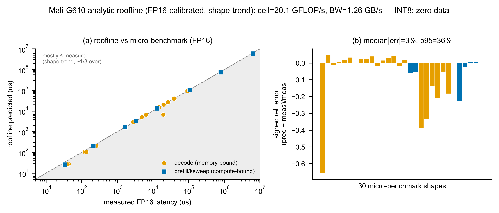

# 05 — M4-GPU：Mali-G610（注意力 offload 單元）

> **本章涵蓋範圍**：Phase 1 對 Mali-G610 GPU 所建立的兩層模型——Phase 1.1 的 micro-benchmark 擬合（主力，已驗證）與 Phase 1.2 的解析 roofline 換型號槽（並存，未驗證 INT8）。說明各層的方程式、資料來源、驗證狀態、已知缺口，以及進入 Phase 2 的就緒度。

---

## 1　模擬什麼

### 1.1　GPU 在架構裡的角色

異構 SoC 的分工邏輯是：CIM 負責 weight-stationary 的投影 GEMM（Q/K/V/O、FFN gate/up/down），而 **attention** 的兩個 bmm（QK^T 與 S·V）運算元都是 runtime 的 activation——每個 decode step，KV-cache 都會長大，沒有可以釘在 crossbar 上的固定權重。強行讓 CIM 做 attention，等同於每步都要把長大的 K/V 重載進陣列，成本以數十毫秒計（CIM-attention penalty 31–46 ms/token，Phase 1.1 P7 量測）。Mali-G610 GPU 做 activation × activation 的 bmm 是日常工作，同樣 kv 長度的 attention 只需幾十到幾百微秒。因此 **GPU = 注意力的 offload 接收方**，是 CIM-centric 設計中不可或缺的支援單元。

### 1.2　Phase 1.1：attn micro-benchmark（主力）

Phase 1.1 對單一 attention head 的 QK^T + S·V（decode 步，FP16）在三個 KV 長度進行量測，並擬合線性模型[^gpu1]：

```
attn_bmm_us(kv) = a + b · kv
               = 27.742 + 0.44208 · kv        （單一 head，FP16，µs）
```

- `a = 27.742 µs`：啟動一次 attention 的固定開銷（截距）。[^gpu2]
- `b = 0.44208 µs/kv`：每多一個 KV token 的邊際成本（斜率）。[^gpu3]

線性形式有物理基礎：decode 的 QK^T（形狀 `[1, hd] × [hd, kv]`）和 S·V（`[1, kv] × [kv, hd]`）都對 kv 個元素各做一次，per-step 成本結構上就線性於 kv，不是強行湊的形式。

此外，Phase 1.1 也量了 GPU 做矩陣乘法的峰值吞吐（方陣 ksweep 與 decode-GEMV）。ksweep 在 M=128 後飽和，FP16 飽和值 **20.12 GFLOP/s**。[^gpu4] 這是用自寫未優化 OpenCL kernel 取得的值，**僅代表下界**（lower bound）——調教過的 kernel 可以更快。Decode-GEMV（M=1）更嚴重利用率不足，量到的有效吞吐約 1.3 GFLOP/s，遠低於 ksweep 飽和值，正好印證「matmul 該留給 CIM」的前提。

### 1.3　Phase 1.2：解析 roofline 換型號槽

Phase 1.2 補充了一個可換型號的解析 roofline 槽（`GpuRooflineModel`），與 Phase 1.1 micro-benchmark 並存而非取代。設計目標是「換一顆 GPU = 換 spec 檔、引擎不動」。方程式為[^gpu5]：

```
latency_us = max( compute_us , memory_us )

  compute_us = 2·M·K·N / (eff_compute_fp16 · fp16_peak_gflops)
  memory_us  = nbytes / mem_eff_BW_GBs
  nbytes（預設）= (K·N + M·K + M·N) · bytes_per_elem
```

兩個校準參數均對 `mali_matmul.json` 的 FP16 點擬合[^gpu6]：

| 參數 | 值 | 來源 |
|---|---|---|
| `eff_compute_fp16` | 0.01965 | ksweep 收斂尾端 f16 吞吐 20.12 GFLOP/s ÷ FP16 峰值 1024 GFLOP/s |
| `mem_eff_BW_GBs` | 1.256 GB/s | 16 個 decode-GEMV 點，lat = nbytes/BW 最小平方過原點 |

`max(compute_us, memory_us)` 的結構讓同一個方程式自動涵蓋兩個 regime：decode（M=1 GEMV）落在 memory-bound 側，prefill / ksweep 大方陣落在 compute-bound 側，`bound` 欄位回傳哪一支贏。

---

## 2　模型從哪來

**主力（Phase 1.1）— calibrated（已量到的矽晶片）**

attn micro-benchmark 來自 Aetina Metis Alpha 板（RK3588，Mali-G610 r0p0）以自寫 OpenCL kernel 實測，量測點在 `measurements/aetina/mali_matmul.json`，attn group、FP16，KV ∈ {128, 512, 1024}。[^gpu7] 擬合由 `tools/analysis/fit_m4_gpu.py` 產生；驗證報告在 `validation/reports/phase1.1/m4_gpu.json`。

**換型號槽（Phase 1.2）— simulated（解析 roofline，FP16 只；非嚴格下界）**

roofline 的兩軸均對 `mali_matmul.json` FP16 點校準（ksweep 5 點 + decode-GEMV 16 點），標記 `simulated`。[^gpu8] 它不是可轉移校準（NOT transferable）——5 個飽和點不足以外推到未見過的 GPU 架構。换一顆 GPU 時需要重跑 `fit_gpu_roofline.py` 並更新 `roofline_fit` 欄位。

---

## 3　驗證狀態

### 3.1　Phase 1.1 attn micro-benchmark — 通過

驗收門檻（ADR-0006）：median ≤10%，p95 ≤20%。

| KV | 量測 µs | 擬合 µs | 相對誤差 |
|---|---|---|---|
| 128 | 83.4 | 84.3 | +1.1% |
| 512 | 255.7 | 254.1 | −0.6% |
| 1024 | 479.7 | 480.4 | +0.1% |

**median {{gpu.attn_median_pct}}%、p95 {{gpu.attn_p95_pct}}%，max {{gpu.attn_max_pct}}%，全部通過。**[^gpu9] 這是全報告擬合誤差最低的單元，反映 attention 對 GPU 是規律的線性工作。


*圖 05-1：Mali-G610 attention bmm 量測 vs 擬合（Phase 1.1）。X 軸 KV 長度，Y 軸單一 head QK^T+S·V 延遲（µs）。三個藍點落在擬合線 `27.742 + 0.442·kv`（橘）上，殘差 ≤1.1%。*

### 3.2　Phase 1.2 roofline — 趨勢驗收（無數值 gate）

對 1.1 量測點（30 點全集）的誤差統計[^gpu10]：

| 統計量 | 值 |
|---|---|
| 點數 | 30 |
| median \|相對誤差\| | {{gpu.roofline_median_pct}}% |
| p95 \|相對誤差\| | {{gpu.roofline_p95_pct}}% |
| max \|相對誤差\| | {{gpu.roofline_max_pct}}% |
| frac\_within\_5pct | 0.667 |
| frac\_pred\_le\_measured | 0.533 |

median ~3% 的含義是「roofline 抓到 decode/prefill 兩個 regime 的形狀趨勢」，**不是**精確校準的宣稱。p95 36% 的長尾來自兩個離群點：1b decode GEMV（K=2048, N=2048，實測異常慢，roofline 樂觀 66%）和最小的 M=64 ksweep（kernel launch 開銷佔比大）。約 47%（≈ 1/2）的點 roofline 高於實測，因此**不是嚴格下界**（frac_pred_le_measured = 0.533，即 53% 的點預測 ≤ 實測）。**沒有數值驗收 gate**——不存在 INT8 矽晶片，不能製造假 gate。


*圖 05-2：Mali-G610 方陣 ksweep FP16/FP32 吞吐（Phase 1.1）。Y 軸 GFLOP/s，X 軸方陣維度 M（對數）。FP16（藍）在 M=128 飽和於約 20 GFLOP/s；標題「LOWER BOUND」提醒此為未優化 kernel 的下界。*



*圖 05-3：Mali-G610 解析 roofline vs micro-benchmark 實測點（Phase 1.2）。左圖：預測 vs 實測散點，對角虛線 y=x，橘點 decode（memory-bound）、藍方 prefill/ksweep（compute-bound）。大多數點貼近對角線，但約 47% 略高（非嚴格下界）。右圖：帶號相對誤差逐點，median ~3%，兩個負向離群點明顯可見。*

---

## 4　缺口 / 外推區

| 項目 | 狀態 | 說明 |
|---|---|---|
| **INT8 GPU GEMM** | 零資料 | Mali matmul kernel 僅 FP32/FP16；`predict()` 對 int8 workload 仍用 FP16 校準天花板，provenance 明標「dtype=int8 has ZERO GPU data」。[^gpu11] 無任何 INT8 驗收 gate。 |
| **FP32 峰值 512 GFLOP/s** | assumption | spec `fp32_peak_gflops=512` 可能低估 2–4×。[^gpu12] 本模型對 FP16 校準，**不依賴**此假設，但 spec 誠實標 assumption，待未來量測驗證。 |
| **kv 外推至 >1024** | 未驗證 | 線性形式結構正確，但斜率/截距在 kv ≤ 1024 擬合，外推到 LongBench 的 ~12k kv 為 **12× 外推**，可能因 cache 行為或 GPU 占用率偏移，需在 kv ∈ {2k, 4k, 8k} 補點確認。 |
| **heads × layers 聚合** | Phase 2 watch-item | `attn_bmm_us` 是單一 head 公式；端到端用 `× heads × layers` 線性放大，聚合行為（overlap 或 kernel 合批）未驗證。短文本下 attention 不是 decode 瓶頸，Phase 2 再展開。 |
| **roofline 可轉移性** | 不可轉移 | 5 個飽和點 + 未優化 kernel，僅對「這顆 G610 在這個 kernel 下」的 FP16 形狀趨勢有效，換 GPU 型號需重新量測並重跑 fit。 |
| **`ksweep_saturation_M` 欄位** | dead param | spec 保留此欄但標 null，引擎未使用（依稽核清單保留、不刪）。[^gpu13] |

---

## 5　進 Phase 2 就緒度

**主力 micro-benchmark（`m4_gpu.py` / `MaliGpuModel`）**：attn 方程式通過 Phase 1.1 驗收（median 0.6%），Phase 2 可直接沿用。GEMM 絕對吞吐標 lower bound，端到端 recompose 中 GPU 只參與 attention offload，不用 GEMM 絕對值，因此不影響系統層 gate。

**roofline 槽（`m4_gpu_roofline.py` / `GpuRooflineModel`）**：引擎介面符合凍結合約 `{latency_us, bound, provenance}`，換型號 = 換 `roofline_fit` 欄位，Phase 2 可直接換 spec 而不改引擎。

**Phase 2 必做項**：
1. 若 Phase 2 模型需要 GPU 做 INT8 GEMM，必須先收集 Mali INT8 kernel 量測資料，現況零資料不可用。
2. heads × layers attention 聚合驗證（watch-item，端到端精度提升時需確認）。
3. kv >1024 的 attn 線性外推補點確認（LongBench workload 需要）。
4. FP32 峰值 512 GFLOP/s 待量測驗證（目前 assumption，不影響 FP16 校準，但影響 spec 可信度）。

---

[^gpu1]: `validation/reports/phase1.1/m4_gpu.json` › `equation.attn` = `"attn_bmm_us = a + b*kv (single-head qkT+sv, f16)"`
[^gpu2]: `simulator/models/params/m4_gpu.json` › `attn_bmm_a_us` = 27.742
[^gpu3]: `simulator/models/params/m4_gpu.json` › `attn_bmm_b_us_per_kv` = 0.44208
[^gpu4]: `simulator/models/params/m4_gpu.json` › `gemm_gflops_saturated_lowerbound` = 20.12；`validation/reports/phase1.1/m4_gpu.json` › `ksweep_saturation.g_sat_gflops_f16` = 20.12，`note` = "absolute throughput = LOWER BOUND (unoptimised kernel)"
[^gpu5]: `validation/reports/phase1.2/m4_gpu_roofline.json` › `equation`
[^gpu6]: `validation/reports/phase1.2/m4_gpu_roofline.json` › `calibrated_fit.eff_compute_fp16` = 0.01965；`calibrated_fit.mem_eff_BW_GBs` = 1.256；`simulator/specs/gpu_mali_g610.json` › `roofline_fit`
[^gpu7]: `measurements/aetina/mali_matmul.json` › `device` = "Mali-G610 r0p0"，`results[group=attn]`；`validation/contracts/m4_gpu.yaml` › `measurement_sources`
[^gpu8]: `validation/contracts/m4_gpu.yaml` › `roofline_slot.honesty` = "simulated"；`validation/reports/phase1.2/m4_gpu_roofline.json` › `calibrated_fit.calibration` = "mali_matmul.json FP16 (ksweep 5 pts + 16 decode-GEMV pts)"
[^gpu9]: `validation/reports/phase1.1/m4_gpu.json` › `attn_offload_gate.median_relerr` = 0.006，`p95_relerr` = 0.011，`max_relerr` = 0.011，`pass_median_le_0.10` = true，`pass_p95_le_0.20` = true
[^gpu10]: `validation/reports/phase1.2/m4_gpu_roofline.json` › `error_vs_1p1_measured.n_points` = 30，`median_abs_relerr` = 0.027，`p95_abs_relerr` = 0.361，`max_abs_relerr` = 0.658，`frac_within_5pct` = 0.667，`frac_pred_le_measured` = 0.533
[^gpu11]: `validation/reports/phase1.2/m4_gpu_roofline.json` › `honesty.int8` = "ZERO INT8 GPU GEMM data; fit + predict are FP16 only."；`simulator/specs/gpu_mali_g610.json` › `notes.int8` = "ZERO INT8 GPU GEMM data; Mali matmul kernel is FP32/FP16 only."
[^gpu12]: `simulator/specs/gpu_mali_g610.json` › `notes.peak` = "FP32 512 GFLOP/s = assumption; may underestimate 2-4x; needs verification."；`validation/reports/phase1.2/m4_gpu_roofline.json` › `honesty.fp32_peak_512`
[^gpu13]: `simulator/specs/gpu_mali_g610.json` › `ksweep_saturation_M` = null，`notes.ksweep_saturation_M` = "DEAD param (kept, not deleted; annotated per audit)."
