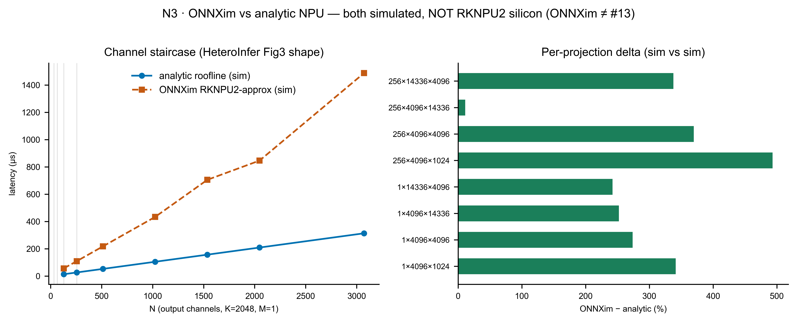

# 06 — M4-NPU：RKNPU2 解析 systolic-roofline（Phase 1 整合章）

> **本章角色：** 本章整合 Phase 1.1（stub 佔位）、Phase 1.2（解析 systolic-roofline 建立）、Phase 1.3（ONNXim 交叉驗證）三個層次的 NPU 模擬結果。**這是全書誠實度最高的挑戰**——這個單元在 Phase 1 裡**完全沒有 silicon**，所有數字都是模擬或借來的。本章把「模擬了什麼、從哪借的、驗收了什麼形狀、為何仍不等於 calibrated」講清楚。

---

## 1　模擬什麼

### 1.1　硬體單元

RKNPU2 是 RK3588 SoC 內建的 NPU，一個 weight-stationary systolic-array 加速器，與 Hexagon 同類。峰值算力：**6 TOPS INT8**（datasheet 值）。[^npu1] 頻率約 **1 GHz**，三個 core，支援的 dtype 限 **INT4/8/16 + FP16**（無 BF16/TF32）。[^npu2] 無 RKNPU2 power telemetry，能耗不可判——本章不報任何 energy 數字。[^npu3]

### 1.2　GEMM：解析 systolic-roofline（padded MACs + order/shape + BW）

INT8 GEMM（M×K×N）模型由三個 ceiling 和一個 dispatch floor 組成，全部從 datasheet 或借來的趨勢推導：

```
padded_MACs = ceil(M/sd)·sd × ceil(K/sd)·sd × ceil(N/sd)·sd
                                            # sd = 借來的 32（Hexagon, HeteroInfer Fig3）
compute_us  = 2·padded_MACs / (6 TOPS) × order_shape_factor(K, N)
                                            # 6 TOPS = datasheet ceiling
memory_us   = weight_bytes / eff_BW_low    # eff_BW_low = ~20.1 GB/s（Fig5 下緣）
latency_us  = max(compute_us, memory_us, dispatch_floor)
bound       = argmax(compute, memory, floor)
```

**對齊 padding（sd = 32，borrowed）：** systolic array 是固定大小的 32×32 方陣；任何不整除 32 的維度都要補滿一整排或一整列，那些補出來的 MAC 是算力浪費。`sd=32` 借自 Hexagon（HeteroInfer SOSP'25 §3.2 Fig3），標 `borrowed`——這是 N.3(a) 的**階梯**來源。[^npu4]

**order/shape factor（1–6×，borrowed）：** 當輸入 activation 相對權重很寬（大 N:K）時，破壞了 weight-stall paradigm，有效吞吐降至 GPU 等級。HeteroInfer §3.2 Fig4 量到最多 **6×** 懲罰。[^npu5] 模型以 log₂(N/K) 線性上升、在借來的 6× 飽和：

```
order_shape_factor(K, N) = min(6.0, 1 + 5 × min(1, log₂(N/K) / log₂(8)))
```

**memory ceiling（BW，borrowed）：** 權重串流 `bytes / eff_BW`，`eff_BW` 取 Fig5 帶的下緣（pessimistic roofline）。有效 BW 帶：**68 GB/s 峰值的 59–66%**（Fig5 single-proc decode 40–45 / 68 GB/s）。[^npu6] 注意：**59–66% 的分母是 68（HeteroInfer 的峰值），不是 RK3588 的 host ~34 GB/s**；RKNPU2 的絕對有效帶換算為 **20.1–22.4 GB/s**（34 × 59–66%）。[^npu7]

**dispatch floor：** 固定 per-op 最低開銷，標 `assumption`（無 silicon，名目值）。

### 1.3　Native Attention（attn_bmm）：純 compute-bound

Native attention 是 activation×activation（QK^T + S·V），沒有靜態權重可 stall，因此是**純 compute-bound**，無 order/shape 懲罰、無權重串流項：

```
per_head_padded = pad(hd) × pad(kv) + pad(kv) × pad(hd)   # QK^T + S·V
per_layer_us    = 2 × heads × per_head_padded / (6 TOPS)
latency_us      = layers × max(per_layer_us, dispatch_floor)
```

heads 作為 batch 維度——**不**補進 systolic M 槽（否則把 GQA heads=8 補到 sd=32 會 4× 高估 attention MACs）；只有 hd、kv 維度被 pad 到 32 的倍數。[^npu8]

---

## 2　模型從哪來

**誠實總覽：Phase 1 的 RKNPU2 模型全部是 simulated 或 borrowed，沒有一個 calibrated。**

| 參數 | 值 | 來源標籤 |
|---|---|---|
| 6 TOPS INT8 | 6.0 | `assumption`（datasheet 峰值） |
| 核數 | 3 | `measured-spec`（datasheet 3-core） |
| 頻率 | ~1 GHz | `assumption` |
| systolic_dim | 32×32 | `borrowed`（Hexagon，HeteroInfer Fig3） |
| order/shape max | 6× | `borrowed`（HeteroInfer Fig4） |
| BW frac | 59–66% / 68 GB/s | `borrowed`（HeteroInfer Fig5） |
| eff_BW absolute | 20.1–22.4 GB/s | `borrowed`（34 × frac） |
| dtypes | INT4/8/16/FP16 | `measured-spec`（datasheet） |
| 能耗 | 不可判 | 無 power telemetry |

**沒有 RKNPU2 silicon。** aetina 板在 Phase 0.3 量測期間離線（issue #13），RKNPU2 matmul/attention micro-benchmark **從未採集**（`measurements/aetina/rknpu2_matmul.json` 不存在）。[^npu9]

**Phase 1.1（stub 佔位）：** `m4_npu.py` 在 Phase 1.1 是一個會報 `NotImplementedError` 的 stub，`validation/contracts/m4_npu.yaml` 標 `BLOCKED`。[^npu10]

**Phase 1.2（解析模型交付）：** ADR-0006 gate 修訂——以解析 systolic-roofline 取代被 block 的 silicon gate，成為 Phase 1.2 deliverable。合約從 `BLOCKED` 改為 `SIMULATED`，並明寫「無 per-op 數值 gate」。[^npu11]

**Phase 1.3（ONNXim drop-in）：** ONNXim（POSTECH，commit `a1e86296`，generic-systolic NPU simulator）被配成 RKNPU2-approx（3 core × 32×32、INT8、`precision:1`、`core_freq` 1000 MHz → 6.14 TOPS ≈ datasheet 6），作為 `engine='onnxim'` drop-in 後端，對解析趨勢交叉驗證。[^npu12]

---

## 3　驗證狀態

### 3.1　issue #13 silicon gate：superseded-not-satisfied（明確聲明）

原 Phase 1.2 計劃要求 per-op median ≤10%、p95 ≤20%（對 RKNPU2 silicon 的數值誤差 gate）。**這個 gate 沒有達成，也永遠不會被達成在 Phase 1**——因為沒有 silicon。ADR-0006 gate 修訂記錄狀態為 **superseded-not-satisfied**：解析 trend-shape 模型取代（supersedes）它成為交付物，但並沒有達成（not satisfied）那個 silicon gate。[^npu13]

> 這是誠實邊界最重要的一句話：**本章不存在任何數值校準結果。**

### 3.2　Phase 1.2 trend-shape 驗收（三條，全標 simulated）

Phase 1.2 的唯一驗收是「形狀對得上 HeteroInfer 的三條借來趨勢」。結果寫在 `validation/reports/phase1.2/m4_npu.json`，三條全 pass，但全部標 `simulated`：

**(a) Fig3 階梯：knee 落在借來的 32×32**

compute-bound 掃描（M=512, K=2048, N=1…256）：延遲**單調不減**（monotone=True）；找到 **7 個 knee**，位置 N=33, 65, 97, 129, 161, 193, 225——全部對齊 32 的倍數，與借來的 sd=32 吻合。[^npu14]


*圖 N1：NPU 32×32 對齊階梯（**SIMULATED**）——藍色階梯在每個 32-block 內完全水平，在 N=33、65、97… 各跳一階，形狀對上 HeteroInfer Fig3。階梯高度由 6 TOPS 推得（assumption），不是量出來的。*

**(b) Fig4 order/shape ≤6×**

wide-activation 掃描（N/K 從 1:2 到 64:1）：order/shape factor 最大值 = **6.00**，等於（不超過）借來的上限 6×。[^npu15] 各 aspect 的 factor 值：N256/K512=1.0、N1024/K512=2.67、N2048/K512=4.33、N4096/K512=6.00（飽和），標 `simulated`。

**(c) Fig5 BW 分率 59–66%（分母=68 GB/s）**

有效 BW 帶 20.1–22.4 GB/s = 68 GB/s × [0.59, 0.66]，落在 [0.59, 0.66] 目標帶內，pass。[^npu16] **重要：59–66% 的分母是 68（HeteroInfer 的 peak），不是 RK3588 的 host ~34 GB/s。**

### 3.3　Phase 1.3 ONNXim 交叉驗證

**ONNXim 不是 issue #13，也不是 silicon 校準。** 它是一個更重的模擬器（cycle-level），與解析 roofline 做 sim-vs-sim 趨勢交叉驗證；#13 silicon gate 維持 superseded-not-satisfied，獨立不受影響。

**15 個 shape**（投影層形狀 M=1,256；K=2048 通道 N=128–3072；以及 M=256 大形狀）的 ONNXim 結果：[^npu17]

| 結果面向 | 值 |
|---|---|
| staircase 單調遞增 | True（與解析同形狀，HeteroInfer Fig3） |
| median \|delta\| | **{{npu.onnxim_median_delta_pct}}%**（ONNXim vs 解析） |
| max \|delta\| | **{{npu.onnxim_max_delta_pct}}%** |
| 典型例：(1,4096,4096) | ONNXim 3121 µs vs 解析 835 µs（+274%） |
| 典型例：(256,4096,14336) | ONNXim 22364 µs vs 解析 20105 µs（+11%，compute-bound 收斂） |



*圖 N3：ONNXim vs 解析 roofline（**sim-vs-sim，無 silicon**）——趨勢方向一致（單調∝N staircase），但 ONNXim 一致地比解析高約 4×（median 318%）。這個系統性 offset 反映 ONNXim 的 cycle-level 開銷（systolic fill/drain、NoC、DRAM scheduling）被解析 roofline 抽象掉，使解析值是偏樂觀的下界。*

**趨勢一致、絕對值差 ~4× 的解讀：** 解析 roofline 是 `max(compute, memory) + factor`——把 systolic pipeline 細節抽象掉，是偏樂觀的下界。ONNXim 把這些 cycle-level 開銷算進去，因此一致偏高。兩者都不是 silicon，不能用誰「對」來評判；**趨勢吻合是這個交叉驗證的全部價值**，~4× offset 被誠實記錄。[^npu18]

**解析 NpuModel 維持 Phase 1.2/1.3 主交付。**

### 3.4　attention offload 比較（mali=silicon，NPU=simulated）


*圖 N2：attention offload 比較（⚠️ 三條線 basis 不同，不可逐 head 直比）——**Mali GPU（綠，實線）= Phase 1.1 silicon fit**；**CIM composed（橘，實線）= Alpha-topology 整模型 KV-reload 罰則估計**（不同 basis，whole-model per-token，非裸 silicon）；**NPU analytic（藍，虛線）= 本章解析估計，SIMULATED**。NPU 虛線只代表趨勢方向，絕對值未經 silicon 驗證。*

NPU analytic attention 的結果非常快——GQA heads（=8）走 batch 維而不補進 systolic M 槽（否則會 4× 高估），使每個 attention op 的 FLOPs 對 6 TOPS 而言極小。方向與 HeteroInfer「NPU ≫ GPU for matmul」的觀察一致，但 attention 的絕對值未經 silicon 驗證。[^npu19]

---

## 4　缺口 / 外推區

| 項目 | 狀態 | 說明 |
|---|---|---|
| 全部數字 | simulated/borrowed | 6 TOPS + dtypes（datasheet）、32×32（Hexagon 借）、BW 帶（HeteroInfer Fig5 借）；無一 fit 到 RKNPU2 silicon |
| 數值 gate | 無 | 無 silicon → 無 per-op median/p95 門檻；只有 trend-shape 勾稽 |
| issue #13 silicon | superseded-not-satisfied | 板離線，micro-benchmark 未採集（ADR-0006）；解析模型取代非達成 |
| NPU 絕對延遲 | 未驗證 | order/shape 與階梯形狀對上 Fig3/4/5；絕對值未經 silicon，只能當趨勢方向 |
| ONNXim ~4× gap | 已記錄，未解釋 | cycle-level vs analytic 的結構性差異；因兩邊都無 silicon 基準，gap 來源無法從外部定責 |
| dtypes BF16/TF32 | 不支援 | 只 INT4/8/16 + FP16（datasheet）；無 BF16/TF32 路徑 |
| 能耗 | 不可判 | 無 RKNPU2 power telemetry |
| ONNXim N≤64 shapes | crash | degenerate tiling SIGFPE；staircase 從 N=128 起跑，N<128 的細小 op 只能用解析 fallback |
| Phase 2 外推 | 高風險 | 目前的 simulated 模型在 Phase 2 integration 裡會**傳播不確定性**，且沒有 silicon 錨點可以修正；任何整機數字若包含 NPU 路徑都需要標 simulated/unverified |

---

## 5　進 Phase 2 就緒度

**interface-ready，但數值不可信。**

`NpuModel(spec, engine='analytic'|'onnxim')` 實作了凍結的 `predict(wl) → {latency_us, bound, provenance}` 介面，與 M1 CIM / M2 Memory / M4 CPU+GPU 同一合約；Phase 2 可直接在 `engine=` 槽切換。[^npu20] `validation/contracts/m4_npu.yaml` 標 `SIMULATED`，並明寫「無 per-op 數值 gate、驗收=三條 trend-shape 勾稽」，不會讓 Phase 2 誤以為它已 calibrated。

**但 Phase 2 有義務標注：** 任何包含 NPU 路徑的整機模擬輸出，provenance 必須傳播 `simulated (RKNPU2, no silicon, #13 superseded-not-satisfied)` 標籤，讓讀者知道這條路徑是純模擬的外推，不是 silicon-calibrated 的結果。

**silicon 升級路徑：** 若 aetina 板回線，`measurements/aetina/rknpu2_matmul.json` 補上後，只需把 `NpuModel` 的 engine 換成 `'calibrated'`，從 JSON fit `Gmax`/`Na`/`Kb`（比照 M4-GPU 的 `gpu_mali_g610` 方式），合約就能從 SIMULATED 升格到 calibrated——Phase 2 不需要動介面。[^npu21]

---

[^npu1]: 來源 `simulator/specs/npu_rknpu2.json` › `tops_int8` = 6（TOPS INT8 datasheet ceiling）
[^npu2]: 來源 `simulator/specs/npu_rknpu2.json` › `dtypes` = ["int4","int8","int16","fp16"]；`freq_ghz` = 1.0；`cores` = 3
[^npu3]: 來源 `simulator/specs/npu_rknpu2.json` › `notes.energy` = "no RKNPU2 power telemetry -> energy not determinable."
[^npu4]: 來源 `simulator/specs/npu_rknpu2.json` › `systolic_dim` = [32,32]；`provenance.systolic_dim` = "Hexagon 32x32 (HeteroInfer) [borrowed]"
[^npu5]: 來源 `validation/reports/phase1.2/m4_npu.json` › `trend_conditions.b_order_shape_vs_fig4.bound` = 6.0；tag = "simulated (borrowed Fig4 ceiling; NO silicon, #13)"
[^npu6]: 來源 `simulator/specs/npu_rknpu2.json` › `bw_GBs.eff_frac_low` = 0.59；`eff_frac_high` = 0.66；`heteroinfer_peak_denominator` = 68
[^npu7]: 來源 `simulator/specs/npu_rknpu2.json` › `bw_GBs.eff_low` = 20.1；`eff_high` = 22.4；`notes.bw_denominator` = "59-66% is of a 68 GB/s peak (HeteroInfer Fig5 single-proc decode)"
[^npu8]: 來源 `simulator/models/m4_npu.py` › `_attn_us` docstring："Heads are the BATCH dimension -- NOT padded into the systolic M slot"
[^npu9]: 來源 `validation/contracts/m4_npu.yaml` › `blocked_on` = "GitHub issue #13 — RKNPU2 micro-benchmark NOT collected (board offline). Silicon absent."
[^npu10]: 來源 `docs/report/phase1.1/chapters/A5-m4-npu.md`：Phase 1.1 時 m4_npu.py 是一個 raises NotImplementedError 的 stub，合約標 BLOCKED
[^npu11]: 來源 `validation/contracts/m4_npu.yaml` › `status` = "SIMULATED"；`no_numeric_gate` = "NO per-op median/p95 numeric gate"；`superseded_gate.note` = "ADR-0006 gate revision: #13 median/p95 silicon gate = superseded-not-satisfied"
[^npu12]: 來源 `tools/onnxim/rknpu2_approx.json` › `num_cores` = 3；`core_config.core_0.core_width` = 32；`precision` = 1；`core_freq` = 1000（MHz）；_doc = "Generic systolic_ws NPU configured to approximate RKNPU2"
[^npu13]: 來源 `validation/reports/phase1.2/m4_npu.json` › `upgrade.issue_13_silicon` = "superseded-not-satisfied: the RKNPU2 matmul/attention micro-benchmark (#13) was NOT collected (board offline)..."
[^npu14]: 來源 `validation/reports/phase1.2/m4_npu.json` › `trend_conditions.a_staircase_vs_fig3.n_knees` = 7；`knee_positions` = [33,65,97,129,161,193,225]；`monotone_nondecreasing` = true；`pass_simulated` = true
[^npu15]: 來源 `validation/reports/phase1.2/m4_npu.json` › `trend_conditions.b_order_shape_vs_fig4.max_factor` = 6.0；`factors_by_aspect.N4096_over_K512` = 6.0
[^npu16]: 來源 `validation/reports/phase1.2/m4_npu.json` › `trend_conditions.c_bw_frac_vs_fig5.frac_low` = 0.59；`frac_high` = 0.66；`rknpu2_abs_band_GBs` = [20.1,22.4]；`pass_simulated` = true
[^npu17]: 來源 `validation/reports/phase1.3/m4_npu_onnxim.json` › `n_shapes` = 15；`median_abs_delta_pct` = 317.9；`max_abs_delta_pct` = 493.4；`staircase_monotone_vs_heteroinfer` = true
[^npu18]: 來源 `validation/reports/phase1.3/m4_npu_onnxim.json` › `note` = "Both ONNXim and the analytic NPU are simulated (no RKNPU2 silicon). This is a sim-vs-sim trend cross-check; the analytic NpuModel stays the Phase-1.2 deliverable."
[^npu19]: 來源 `docs/report/phase1.2/chapters/N-npu.md` §N.3 attention offload 說明：NPU analytic 畫成虛線 + 標 SIMULATED；GQA heads 走 batch 維不補進 systolic M 槽
[^npu20]: 來源 `simulator/models/m4_npu.py` › `NpuModel.predict` 回傳 `{latency_us, bound, provenance}`（frozen contract）；`engine='analytic'|'onnxim'` 皆支援
[^npu21]: 來源 `validation/contracts/m4_npu.yaml` › `upgrade.issue_13_silicon` = "superseded-not-satisfied (NOT achieved; board offline...)"；`upgrade.onnxim_phase_1_3` = "Phase 1.3 drops ONNXim..."
