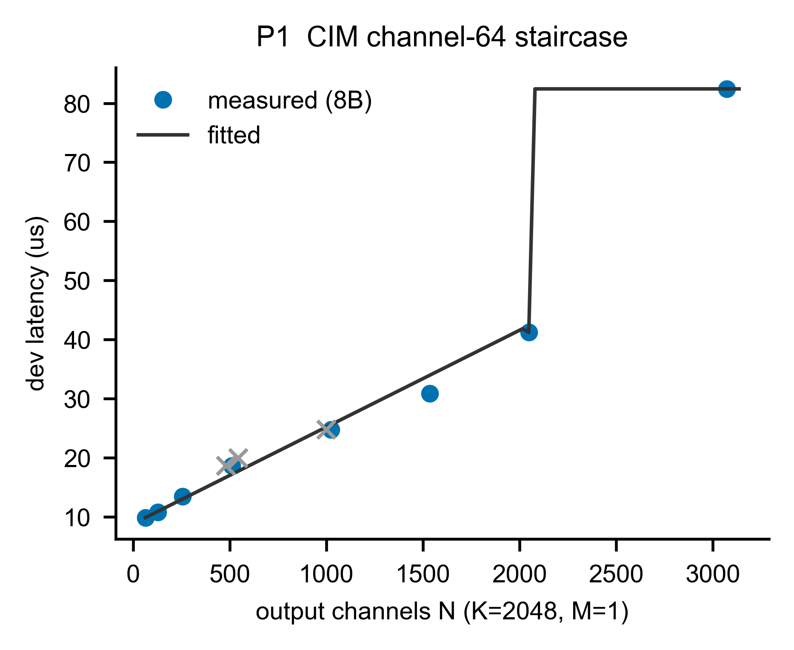
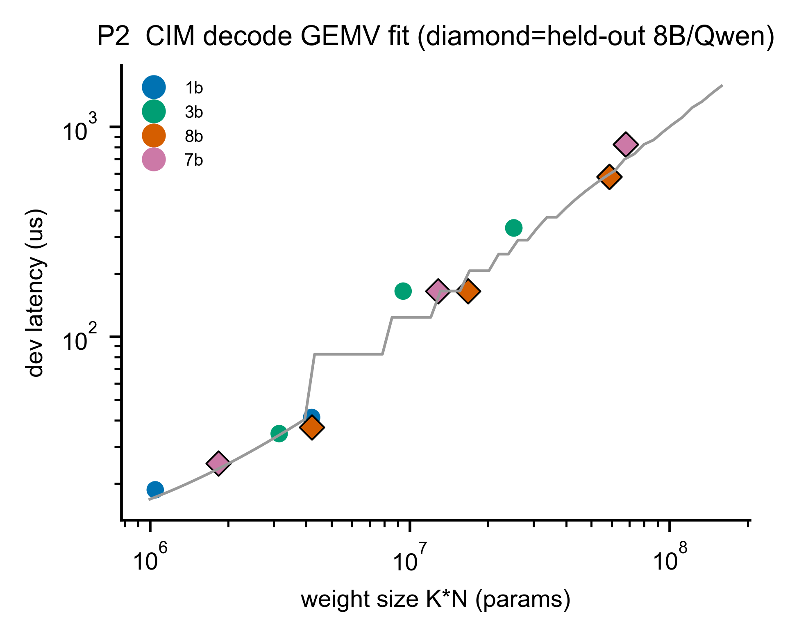
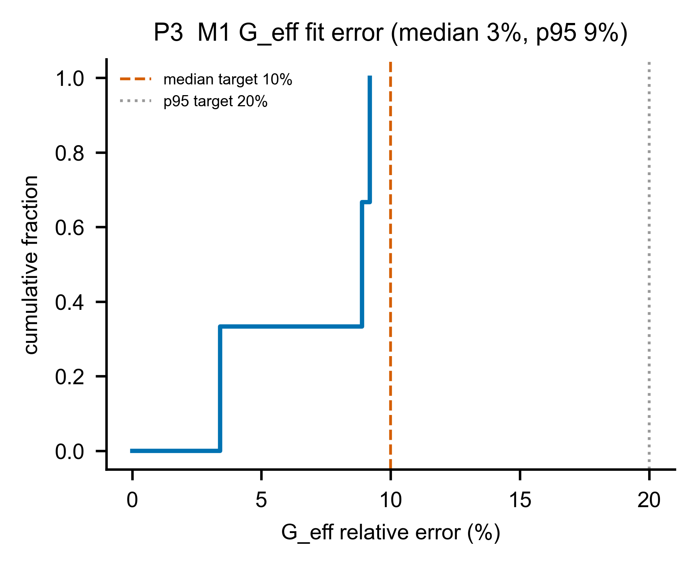

# A1 — M1：CIM tile 時間模型（系統的主角）

> **這一章你會學到**：CIM 怎麼在硬體上算一次矩陣乘法、為什麼會分成「兩種情況」、我們用什麼公式去描述它、這個公式準不準（量測 vs 預測），以及一個有趣的 CIM-centric 發現：GQA（Grouped-Query Attention，一種讓 K/V 投影輸出維度變窄、藉此省 KV-cache 的設計）的窄維度會「塞不滿」crossbar。

---

## A1.1 架構考量：M1 在系統裡是誰？

回顧 §0.7 的 6-box 架構，M1 是「**③ 各單元時間模型**」裡的 **CIM 那一格**。CIM 是整個系統的**主力計算單元**，負責 LLM 裡最吃計算量的部分——**weight-stationary 的矩陣乘法**：

- 每一層的 **Q/K/V/O 投影**（把 hidden 向量投影成 query/key/value/output）
- **FFN 的三個矩陣乘法**（gate / up / down）
- 最後的 **lm_head**（把 hidden 投影成詞表大小的 logits）

一個 decode token 要把上面這些跑滿 **L 層**（例如 8B 模型 L=32 層）再加一次 lm_head。所以 M1 被呼叫的次數非常多，它的公式準不準，直接決定整個 decode 預測準不準。

**M1 要回答的問題**：給一個矩陣乘法的形狀 `(M, K, N)`，CIM 算它要花多少 **device 計算時間（µs）**？

> ⚠️ **重要邊界**：M1 只算「**device 上純計算**」的時間，**不含** host 和 CIM 之間搬資料的 911µs 來回成本——那筆是 **M2（A2 章）** 的事。把「算」和「搬」分開，是乾淨模組化的關鍵（Phase 2 才把兩者組起來）。

---

## A1.2 原理：CIM 怎麼算矩陣乘法，為什麼有「兩種情況」

CIM 的核心是一個 **2048 × 2048 的 crossbar（交叉陣列）**。你可以把它想成一張 2048 列 × 2048 行的「乘加表格」：把權重矩陣**釘**在上面，輸入向量從一邊流進去，每一行同時完成「輸入 × 該行權重」的乘加，一次就吐出一整段輸出。**這就是 weight-stationary：權重不動，省掉搬權重。**

decode 時 M=1（一次一個 token），所以矩陣乘法是 `[1×K] × [K×N]`，也就是 **GEMV**。這時候「輸出通道數 N」決定了我們用掉 crossbar 的幾行。由此產生**兩種情況**：

**情況一：窄輸出（N < 2048）——塞不滿一塊 tile。**
如果 N 很小（例如 GQA 的 K/V 投影 N=512），crossbar 大部分的行是空的，**利用率低**。我們用「**有效吞吐 G_eff(N)**」（單位 GFLOP/s）來描述：N 越大、塞越滿、吞吐越高，到 N≈1500 左右就**飽和**。實測的「channel-64 階梯」長這樣：

| N（輸出通道） | 64 | 128 | 256 | 512 | 1024 | 1536 | 2048 |
|---|---|---|---|---|---|---|---|
| 有效吞吐（GFLOP/s） | 26.6 | 48.6 | 78.0 | 112.7 | 169.8 | 204.0 | 203.6 |

看到沒？N 從 64 → 1536，吞吐從 27 一路爬到 204，然後就**飽和**不動了。這就是「塞滿了」。

**情況二：滿/多 tile（N ≥ 2048）——要切塊。**
如果矩陣比一塊 crossbar 大（例如 FFN 的 `4096 × 14336`），就得**切成好幾塊 tile** 分次算。需要的塊數：

```
n_tiles = ⌈K / 2048⌉ × ⌈N / 2048⌉       （⌈⌉ = 無條件進位）
```

例如 8B 的 gate_up `4096 × 14336` → `⌈4096/2048⌉ × ⌈14336/2048⌉ = 2 × 7 = 14` 塊。每一塊都是塞滿的 2048×2048，所以**時間 = 塊數 × 一塊滿 tile 的時間**。

還有一個獨立的硬體限制叫 **device envelope ≈ 6M**：當 `K·N` 超過約 600 萬個參數，裝置一次**配置（記憶體 allocation）**不下。注意這是「能不能一次塞進裝置」的限制，**跟上面「N<2048 還是 N≥2048」那個決定延遲公式的分支是兩回事**——envelope 主要影響的是「要拆成幾次呼叫、每次都付一筆 911µs floor」，那筆成本在 **M2（A2 章）** 處理，不在這條 device 計算公式裡。

---

## A1.3 參數設計：公式長什麼樣，為什麼這樣設計

把上面兩種情況寫成一條公式（這就是 `simulator/models/m1_cim_tile.py` 在做的事）：

```
                ┌─ 若 N < 2048：  dev_lat = 2·M·K·N / G_eff(N)          （窄：吞吐隨填充度變）
dev_lat(M,K,N) =│
                └─ 若 N ≥ 2048：  dev_lat = M · n_tiles · T_tile        （滿：每塊都滿，數塊數）
```

三組參數，全部從**真晶片量測**擬合或讀出：

1. **`G_eff(N)`——有效吞吐曲線**。我們用一條飽和曲線（Hill 函數）去貼上面那張階梯表：
   ```
   G_eff(N) = Gmax · N / (N + Nhalf)
   ```
   擬合結果 **Gmax = 250.1 GFLOP/s**（理論飽和吞吐）、**Nhalf = 537.8**（吞吐爬到一半時的 N）。
   - **為什麼用這個形狀？** 因為實測就是「小 N 低、大 N 飽和」的飽和曲線，Hill 函數正好是這個形狀，而且只要 2 個參數、可平滑外推到沒量過的 N。

2. **`T_tile = 41.21 µs`——一塊滿 tile 的延遲**。直接取自實測（N=2048 那一點）。`n_tiles` 用上面的進位公式算。

3. **`tile = 2048`、`envelope = 6,000,000`**——crossbar 大小與裝置容量上限。

> **為什麼是公式而不是查表？** 我們先試著用 Hill 公式擬合那 8 個階梯點，**相對誤差中位數只有 3.4%**（門檻是 ≤ 10%）。既然公式夠準，就用公式（體積小、可外推、參數有物理意義）；只有當公式擬合不佳時才退回查表（lookup fallback）。M1 的情況是 `use_lookup = False`，公式贏。

---

## A1.4 Measurement vs Prediction（量測 vs 預測）

把公式算的值（prediction）和真晶片量的值（measurement）擺一起比。M1 的形狀分兩組看：

**（A）滿/多-tile 投影（12 個形狀，四個模型的 q_o / gate_up / down）：**

| 模型 | 投影 | K×N | 量測 µs | 預測 µs | 相對誤差 |
|---|---|---|---|---|---|
| 1B | q_o | 2048×2048 | 41.2 | 41.2 | 0.0% |
| 1B | gate_up | 2048×8192 | 164.8 | 164.8 | 0.0% |
| 8B | q_o | 4096×4096 | 164.8 | 164.8 | 0.0% |
| 8B | gate_up | 4096×14336 | 576.8 | 576.9 | 0.0% |
| Qwen | gate_up | 3584×18944 | 824.0 | 824.2 | 0.0% |

> 🔴 **這裡要非常誠實**：這 12 個誤差全是 **0.0%**，但這**不是**獨立的驗證！原因是——這些形狀的「量測值」根本不是獨立量到的：其中**那一格 2048×2048（單一滿 tile）本身就是我們用來定 `T_tile` 的校準點**；其餘 11 個大形狀**在 Alpha 裝置上原生量不到**（太大），所以 Phase 0.3 的值就是用 `T_tile × n_tiles` 推算的（資料裡標了 `tiled_extrapolated`）。我們的公式又用同一條 `T_tile × n_tiles`——無論哪一種，都是**自己對自己**（circular），當然吻合。
>
> 那 M1 真正「獨立」被驗證的地方在哪？三個：
> 1. **G_eff 階梯擬合**：8 個原生量測點，誤差中位數 **3.4%**、p95 **8.9%**（過 10%/20% 門檻）。
> 2. **階梯 held-out**：用 N≤1536 擬合、預測 N=2048，誤差 **3.5%**（考沒看過的點）。
> 3. **下面（B）的窄 kv 投影**：這些是**原生量測**，是真正的考題。

**（B）窄 kv 投影（4 個，原生量測，這才是硬考題）：**

| 模型 | K×N | 量測 µs | 預測 µs | 相對誤差 |
|---|---|---|---|---|
| 1B | 2048×**512** | 18.6 | 17.2 | **+7.7%** |
| 3B | 3072×**1024** | 34.5 | 38.4 | **+11.2%** |
| Qwen | 3584×**512** | 24.9 | 30.1 | **+20.8%** |
| **8B** | **4096×1024** | **36.9** | **51.2** | **+38.6%** ⚠️ |

8B 那筆 **+39%** 是最大的殘差。為什麼？這就是下一節的發現。

---

## A1.5 一個 CIM-centric 發現：GQA 窄維度的「塞不滿」殘差

注意 8B 的 kv 投影是 `K=4096`（很寬）、`N=1024`（較窄）。我們的公式 `G_eff(N)` **只看 N**，用 Hill 公式算 N=1024 的吞吐約 **164 GFLOP/s**（`250.1×1024/(1024+537.8)`）。但真晶片量到的是 **227 GFLOP/s**（更快！）。為什麼真晶片更快？**因為 K 很寬（4096）也會幫助吞吐**，而我們的 N-only 公式不知道這件事 → 它低估了吞吐 → **高估了延遲**（51.2 vs 36.9，+39%）。

- 這正是 Phase 0.3 記到的 **GQA-narrow underfill**：GQA（Grouped-Query Attention）的 K/V 投影故意把輸出維度做窄（省 KV-cache），這個窄維度在 crossbar 上**填不滿**，效率與一般投影不同。
- **為什麼不修公式？** 因為「寬 K 幫助吞吐」這個效應，我們**只有 8B kv 這一個資料點**能看到——一個點無法擬合一條 K-修正曲線。所以我們**誠實地把它單獨列出來當殘差報告（不放進 gate 評分）**，而不是硬湊一個係數讓平均誤差好看。
- **這其實是個值得寫進論文的發現**：GQA 的窄維度設計，在 CIM 上有「塞不滿、效率被平均誤差蓋掉」的結構性現象——正好呼應 CIM-centric 的主張（系統要繞著 CIM 的填充特性設計）。

---

## A1.6 圖片解釋

**圖 A1-1（P1）— CIM channel-64 階梯：量測 vs 公式**

- **X 軸**：輸出通道數 N（固定 K=2048、M=1，也就是 decode）。
- **Y 軸**：device 計算延遲（µs）。
- **藍點**：8B 真晶片量測。**深灰線**：我們的公式。**灰色 ×**：刻意測的「非 64 倍數」點（驗證 64 對齊）。
- **怎麼看**：N 從 64 到 2048，延遲沿著公式線平滑上升（G_eff 飽和的效果）；到 **N>2048 突然跳一階**——因為需要第二塊 tile（41.2 → 82.4 = 2 塊）。這張圖證明「窄→吞吐隨 N 變」+「大→切 tile」兩種情況都被公式抓到了。

**圖 A1-2（P2）— decode GEMV 跨模型擬合**

- **X 軸**：權重大小 K·N（參數量，**對數軸**）。**Y 軸**：延遲（µs，對數軸）。
- **顏色**：不同模型（1B/3B/8B/Qwen）。**菱形**：held-out（8B、Qwen 的投影，沒拿來定參數的「考題」）。
- **怎麼看**：所有點都落在公式線附近，跨四個模型、跨兩個數量級的 K·N 都成立。對數-對數下接近直線，反映「延遲大致正比於計算量」。

**圖 A1-3（P3）— M1 擬合誤差分佈（CDF）**

- **X 軸**：相對誤差（%）。**Y 軸**：累積比例（有多少比例的點誤差小於某值）。
- **兩條垂直虛線**：中位數門檻 10%、p95 門檻 20%。
- **怎麼看**：曲線整個落在門檻線左邊，代表 G_eff 擬合誤差（中位 3.4%、p95 8.9%）穩穩過關。

---

## A1.7 限制與 gap（誠實清單）

| 項目 | 狀態 | 說明 |
|---|---|---|
| 多-tile 投影的 0% 誤差 | ⚠️ 非獨立 | 量測值本身是 `T_tile×n_tiles` 推算的，公式重現它是循環；真正驗證靠 G_eff 階梯 + 窄 kv 殘差 |
| 8B 窄 kv +39% 殘差 | 📌 單獨報告 | 寬-K 幫助吞吐，單一資料點無法擬合 K-修正 → 不進 gate，列為 CIM 發現 |
| lm_head（N≈128k/152k） | ❌ 無量測 | 太大，裝置測不到；用 `n_tiles × T_tile` **解析合成**，無真值 |
| prefill（M≥512） | ❌ 未驗證 | 大 M 在裝置上配置失敗；只能解析外推，**unvalidated** |
| Qwen 非-2048 維 | ✅ 已處理 | 用 **padded tile** 預測（不需「還原係數」）；那個 ~1.24× 只是 GFLOP/s 的**報告偏差**，不是延遲誤差 |

**一句話總結 A1**：CIM 的 decode 計算時間能用「窄→G_eff 飽和曲線、滿→數 tile」這條雙模式公式描述，獨立驗證誤差中位 3.4%；唯一明顯的殘差（8B 窄 kv +39%）是 GQA 窄維度的 underfill，我們誠實地單獨報告而非掩蓋。下一章 A2 處理「搬資料」那一半——記憶體與 PCIe。
