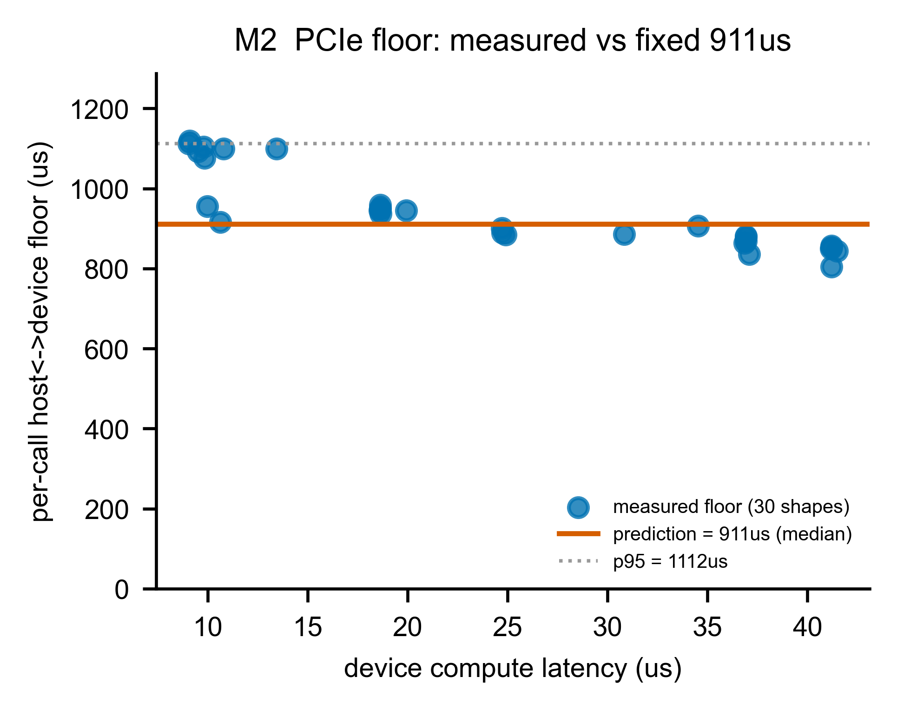

# A2 — M2：記憶體階層（「搬資料」那一半）

> **這一章你會學到**：為什麼「搬資料」跟「算」一樣重要、PCIe 上那筆神祕的 911µs 固定成本是什麼、它什麼時候要付什麼時候不用付、host 記憶體（LPDDR5）我們怎麼估、以及 KV-cache 這個在長文本下會吃掉 1/3 頻寬的隱形成本。

---

## A2.1 架構考量：M2 是誰？為什麼「搬」這麼重要？

A1 的 M1 算的是「**算**」——CIM 在 crossbar 上做乘加。但資料不會自己出現在 crossbar 上，得**搬**進去、結果再搬出來。**M2 就是負責「搬」這一半**，對應 §0.7 架構的「**④ 記憶體階層**」。

為什麼搬這麼重要？回顧 §0.3：**decode 是 memory-bound**（卡在搬權重，不是卡在算）。所以一個 8B 模型每吐一個 token 要搬 7.5 GB 權重——**搬得多快，幾乎就決定了 decode 多快**。M1 算得再快，搬不過來也沒用。

M2 要模型化三件事：

| 子模組 | 負責什麼 | 對應 |
|---|---|---|
| **2a PCIe / DMA** | host ↔ CIM 之間「一次搬移」要多久 | 那筆 911µs 固定成本 + 頻寬 |
| **2b host LPDDR5** | 模擬 SoC 的主記憶體頻寬 | 24 GB/s 的記憶體牆 |
| **2c kv_cache** | 每個 token 把新的 K/V 存進快取的成本 | 長文本下的隱形頻寬 |

---

## A2.2 原理 + 參數（2a：PCIe 與那筆 911µs 固定成本）

**先講 PCIe 和 DMA 是什麼。** CIM 是一張插在 **PCIe** 插槽上的卡（就像顯卡）。host（主處理器）要餵資料給它，得透過 PCIe 做一次 **DMA（Direct Memory Access，直接記憶體存取）**——把一塊資料從 host 記憶體搬到裝置。**每一次這樣的搬移，都有兩部分成本：**

```
一次搬移時間 = 固定開銷（floor） + 資料量 ÷ 頻寬
transfer_us  = 911 µs          + bytes ÷ 3.9 GB/s
```

- **固定開銷（floor）= 911 µs**：不管你搬多少資料，**光是「發起一次 DMA」這個動作**就要約 911 微秒（建立傳輸、等待、同步…）。這是我們從真晶片量出來的常數。
- **頻寬 = 3.9 GB/s**：PCIe Gen3 ×4 的文件規格值；資料量越大、這部分越久。

**這筆 911µs 為什麼這麼關鍵？** 因為 decode 的單次計算很小（M1 算過，一個小 GEMV 的 device 時間只有 ~18–165 µs），可是**只要它得走一次 PCIe，就要先付 911µs**——固定成本是計算本身的 5–50 倍！這就是 CIM「算得快、卻輸在來回」的結構性弱點。

**⚠️ 最重要的一個邊界：這筆 floor 什麼時候付、什麼時候不付？**

這裡要很小心，因為它牽涉到「我們量的板子」和「我們模擬的目標」是兩回事（§0.4 提過）：

- **我們量測的 Alpha 板**：**沒有 on-card DRAM**（卡上沒有自己的記憶體），所以連權重都得每次從 host 走 PCIe 搬 → **每次 decode 呼叫都付 911µs**。這是**該板的拓樸限制，不是 CIM 的本質**。
- **我們模擬/預測的目標（量產卡那種有 on-card DRAM 的拓樸）**：decode 串流權重時，權重就在卡上的 DRAM，**不需要每次走 PCIe** → **decode 不每次付這筆 floor**。

所以模型把 floor 的「適用範圍」講清楚：**floor 只對「離散的 host↔device 搬移」收費**——也就是 KV-reload、activation handoff、混合精度的 conversion-op 這類真的要過 PCIe 的流量；而 **decode 串流權重的主幹用頻寬項、不逐次付 floor**。Part B 的端到端預測就是照這個邊界，**故意不把 Alpha 的 911µs 外推**到量產卡。

> **參數怎麼來的？** 我們**沒有**做「不同資料量 × 傳輸時間」的完整掃描（那是 Phase 0.3 的一個 collect-what-you-can 缺口），所以 **911µs 和 3.9 GB/s 都當固定參數**，不重新擬合斜率。這點在報告裡誠實標註。

---

## A2.3 Measurement vs Prediction（2a：那筆 floor 真的是固定的嗎？）

我們怎麼量到 911µs 的？很巧妙：**同一個運算量兩個值**——
- **device latency**：只算「在裝置上計算」的時間（M1 那個）。
- **system latency**：從 host 角度看的「整趟來回」時間。

**兩者相減 = 那一趟付的固定來回成本（floor）**。我們在 30 個單-tile 形狀上各算一次，得到下圖：

**圖 A2-1（M2 PCIe floor）— 量測的 floor vs 固定 911µs 預測**

- **X 軸**：device 計算延遲（µs）——代表「這個運算多大」（這張圖只取單-tile 形狀，範圍約 9µs 到 41µs）。
- **Y 軸**：實測的每次呼叫 floor（= system − device，µs）。
- **藍點**：30 個形狀各自量到的 floor。**橘線**：我們的預測（911µs 中位數）。**灰虛線**：p95（1112µs）。
- **怎麼看（關鍵）**：藍點全都落在一條 **805–1120µs 的帶**裡——和它對比的「資料量項 `bytes/BW`」對這些小 decode GEMV 幾乎是 0（搬幾 KB÷3.9GB/s ≈ 零點幾 µs）。所以**這趟來回的成本幾乎全部來自那筆固定開銷**，是不折不扣的主導項。
- **但要誠實看圖**：藍點**不是完全水平**——你會看到它隨運算變大**微微往下滑**（小運算約 1100µs → 大運算約 810µs，統計上負相關 r≈−0.86，約 −7µs/µs）。這可能是大運算時 DMA 和計算有部分重疊（double-buffering）所致。重點是:**這個漂移幅度(~300µs)遠小於 floor 本身(~900µs)**,所以我們用**一個固定常數 911µs 當一階近似**,並把這個與大小相關的漂移**誠實地併入殘差帶**(中位 911、p95 1112)。

> 換句話說:**measurement = 沿著一條微降趨勢散在 805–1120 的藍點;prediction = 一條 911µs 的水平線**。模型抓對了「來回成本主導、約 900µs」這個本質,但**沒有**宣稱它跟運算大小完全無關——那個微降趨勢是已標註的殘差。

---

## A2.4 LPDDR5 host 記憶體（2b：解析模型，誠實標註）

模擬的 SoC 用 **LPDDR5**（行動裝置常見的低功耗 DRAM）當 host 主記憶體。我們需要知道它的**有效頻寬**（每秒能串多少權重）。

- **JEDEC 規格峰值**：以一個代表性的行動配置 **LPDDR5-6400、4×16-bit 通道** 算，理論峰值 **51.2 GB/s**。
- **有效頻寬**：真實達到的頻寬一定低於峰值（記憶體牆）。我們取**量測到的 decode 牆 ~24.2 GB/s**當有效值——也就是峰值的 **47%**。這個「達不到峰值」很正常，是 memory-bound 工作負載的典型效率。

**⚠️ 誠實標註**：這個 LPDDR5 模型是**解析（analytic）的**，不是逐點量測擬合的——因為：
1. 我們的模擬目標是「host-LPDDR5 SoC」，但量測板子不是這個拓樸。
2. 更精細的 DRAM 時序模擬器 **Ramulator2** 是規劃中的後端,但**延到 Phase 2** 才接（ADR-0002 說好記憶體後端是可抽換的）。

所以 2b 的「驗證」不是 meas-vs-pred 的擬合誤差,而是**合理性檢查**:有效頻寬要落在 `[0.4×峰值, 峰值]` 之間、而且要 bracket（夾住）量測到的 ~24 GB/s 牆。24.2 落在 [20.5, 51.2] 內、且 ≈ 24,通過。

---

## A2.5 KV-cache（2c：長文本下的隱形成本）

**KV-cache 是什麼？** decode 時，模型要「回看」前面所有 token 的 Key/Value。為了不每次重算,把每個 token 的 K、V **存起來（cache）**,下個 token 直接讀。每生一個新 token,就要把它的 K/V **append（附加）** 進 cache——這是一個**純記憶體頻寬**的動作（搬 bytes,不做計算）。

我們的模型很簡單:`kv_append_us = kv_bytes ÷ 有效頻寬`。

**為什麼要特別講它?** 因為在**長文本**下它一點都不小:Phase 0.2 的統計顯示,在 LongBench(prompt 約 11800 個 token)的 decode 階段,**kv_cache 佔了 12.6–33.5% 的 bytes**(8B 模型 22.2%、3B 最高 33.5%)——在多數模型是僅次於 matmul、attention 的**第三大頻寬消耗**(而 **3B 模型甚至超過 attention、躍居第二**)。短文本可忽略,長文本不行;Phase 2 要跑 LongBench,漏了它會系統性低估。

**⚠️ 誠實標註**:Phase 0.3 **沒有單獨量測** KV-append(另一個 collect-what-you-can 缺口),所以這是**解析模型、unvalidated（未驗證）**——比照 A1 對「lm_head / prefill」的處理,明講沒有真值。

---

## A2.6 一個給 Phase 2 的設計決定:不要建 SRAM residency

Metis 有片上 SRAM(L1/L2)。直覺上可能會想:模擬器要不要建一個「資料放 L2 還是放 DRAM」的階層模型?

**我們的量測給了明確答案:不要。** Phase 0.3 量過「權重放 l2 vs 放 ddr」的延遲比,結果是 **1.00–1.01×(幾乎沒差)**。為什麼?因為 **Alpha 板沒有 on-card DRAM**,所謂的「ddr」其實就是 host LPDDR over PCIe,這個軸在這塊板上**根本不是有意義的駐留軸**。

所以我們把這個決定**明確寫進 M2 的合約**:「**不建 SRAM L1/L2 residency 模型**」,免得 Phase 2 誤以為要做。這是「把已知的事寫死、避免下游重複踩坑」的模組化紀律。

---

## A2.7 限制與 gap(誠實清單)

| 項目 | 狀態 | 說明 |
|---|---|---|
| PCIe floor / BW | ✅ 固定參數 | 911µs + 3.9 GB/s;**無逐點 PCIe 掃描**(Phase 0.3 缺口)→ 不重擬斜率 |
| LPDDR5 頻寬 | ⚠️ 解析 | 24.2/51.2 GB/s(47%);非逐點擬合;Ramulator2 延 Phase 2 |
| kv_cache append | ❌ 未驗證 | 解析 `kv_bytes/BW`;Phase 0.3 沒單獨量;但長文本佔 12.6–33.5% 不可省 |
| SRAM residency | ✅ 決定不做 | l2/ddr ≈1.0(Alpha 無 on-card DRAM)→ 合約寫死不建 |
| floor 適用邊界 | ✅ 已界定 | 只對離散 host↔device 搬移收費;decode 串流不逐次付(見 A2.2) |

**一句話總結 A2**:「搬資料」的成本由「一次約 911µs 的固定來回 + 頻寬」描述,這筆來回成本主導(對小 GEMV 而言 `bytes/BW` 幾乎是 0),我們用固定常數 911µs 做一階近似、把隨運算大小的輕微下滑(r≈−0.86)併入殘差帶;host 記憶體用解析的 LPDDR5 模型(~24 GB/s 牆,Ramulator2 延後);KV-cache 在長文本下是真實成本但本期未驗證。**M1(算)+ M2(搬)合起來,就是 CIM 路徑的完整成本**——接下來 A3/A4 看 CIM 不擅長的事丟給誰做。
