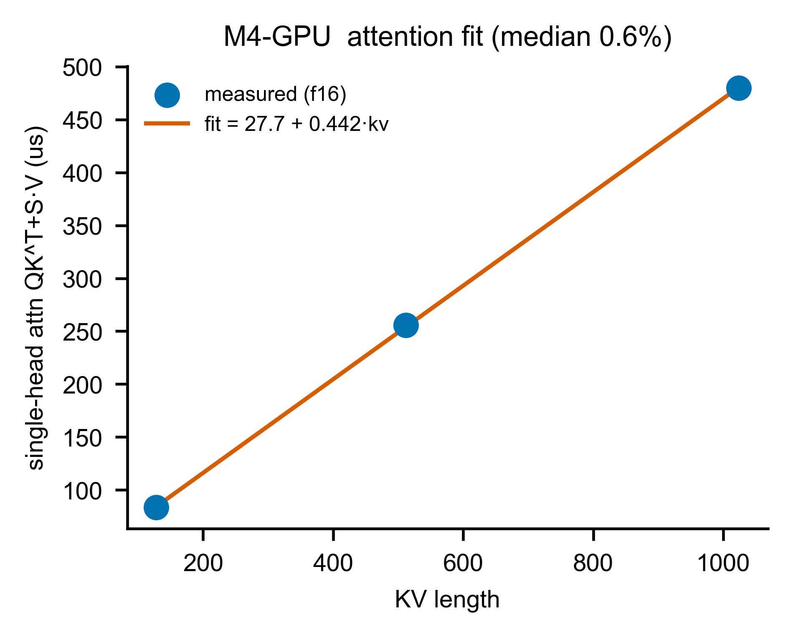
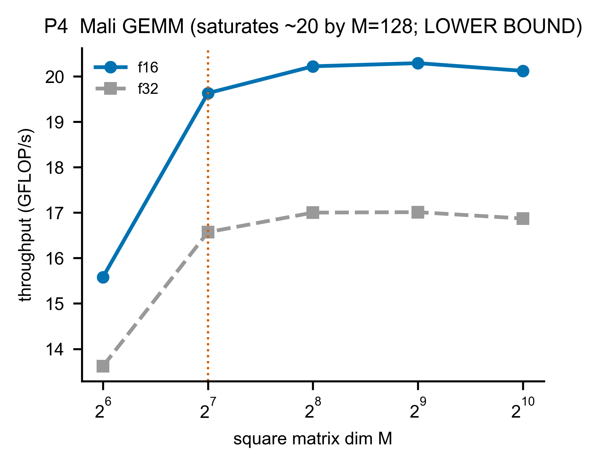

# A3 — M4-GPU：Mali GPU（attention 的接收方）

> **這一章你會學到**：為什麼 attention 一定要從 CIM「外包」出去、GPU 怎麼接這個球、它的成本公式長怎樣（而且超準，誤差 0.6%）、以及一個誠實但重要的事實——這顆 GPU 的矩陣乘法其實**很慢**，慢到我們只能把它的絕對值當「下界」用。

---

## A3.1 架構考量：GPU 在系統裡是誰？

回顧 §0.4 的 CIM-centric 哲學：CIM 擅長 weight-stationary 的矩陣乘法，但**不擅長 attention**。那 attention 丟給誰？本期我們用 **Mali-G610 GPU** 當 **attention 的 offload（外包）接收方**。

在 §0.7 的架構裡，GPU 屬於「**③ 各單元時間模型**」的一格，是 CIM 的**支援層**。它要回答的問題：給一段 attention（KV 長度 = kv），GPU 算它要多久？

> **為什麼是 GPU 不是 NPU？** 兩個都是候選。但本期 NPU（RKNPU2）卡在 issue #13 沒量到（見 A5），所以**這一輪的 offload 對照組是 GPU**。「attention 該 offload」這個結論，目前站在 GPU 的數據上。

---

## A3.2 原理：為什麼 attention 對 CIM 是毒藥、對 GPU 是日常？

回顧 §0.3，attention 的核心是兩個 **batch 矩陣乘法（bmm，即「每個 head 各做一次的小矩陣乘法」，一批 head 一起算所以叫 batch）**：
1. **QK^T**：把 query 和所有 key 做內積（算「這個 token 該注意誰」）。
2. **S·V**：把注意力權重和所有 value 相乘（把該注意的資訊加權取出）。

**關鍵差異**：這兩個 bmm 的**兩個運算元都是「會隨 token 變動的中間資料」**（這個資料在 ML 裡叫 **activation／激活值**，注意**不是** §0.3 那個激活*函數* SwiGLU）——K 和 V 是隨著 token 一直長大的 KV-cache，不是固定的權重。

- 對 **CIM**：weight-stationary 的前提是「有一個固定的權重釘在 crossbar 上」。但 attention 沒有固定權重——每個 decode step 都得把長大的 K/V **重新載入** crossbar。這就**違反了 CIM 省電的本質**（A1 講過），成本爆炸（Part B 會算出 CIM attention 要 31–46 ms/token）。
- 對 **GPU**：GPU 本來就是設計來算「activation × activation」的通用矩陣乘法，這對它是**日常**。所以 attention 在 GPU 上只要幾十到幾百微秒。

**這就是「attention 要 offload」的硬道理**：不是偏好，是 CIM 的物理限制。

> **澄清（你問的 Q6）：attention 也包含矩陣乘法，那「GEMV 適合 CIM、attention 適合 GPU」到底在分什麼？**
> 分的**不是**「有沒有矩陣乘法」——投影（Q/K/V/O、FFN）和 attention（QK^T、S·V）**全都是矩陣乘法**（decode 時都是 GEMV/bmm）。真正的分界是 **「其中一個運算元是不是固定的權重」**：
> - **投影 / FFN**：activation × **固定模型權重**（W_q、W_gate… 是訓練好的常數）→ 權重可以**釘在 crossbar 上不動**（weight-stationary）→ **CIM 的主場**。
> - **attention**：activation × **activation**（Q、K、V 全是 runtime 資料，K/V 還隨上下文長大）→ **沒有固定權重可釘**，每個 decode step 都要把長大的 K/V 重載進陣列 → 違反 CIM 省電前提 → **丟給 GPU/NPU**（它們做通用 activation×activation 是日常）。
>
> 所以精確的講法是：**weight-stationary 的 matmul → CIM；activation×activation 的 matmul → GPU/NPU**。我先前「GEMV 適合 CIM、attention 適合 GPU」是簡化說法，這裡是精確版。

---

## A3.3 參數設計：attention 成本公式

我們量了 GPU 上單一 attention head 的 QK^T + S·V，在三個 KV 長度（kv ≈ 128 / 512 / 1024），用 FP16。發現成本**隨 kv 長度線性增加**——很合理，因為 kv 越長、要算的內積越多。於是擬合一條直線：

```
attn_bmm_us(kv) = a + b · kv
              = 27.74 + 0.442 · kv        （單一 head，FP16，µs）
```

- **a = 27.74 µs**：截距，可理解為「啟動一次 attention 的固定開銷」。
- **b = 0.442 µs/kv**：斜率，每多一個 KV token 多花 0.442 µs。

> **單一 head 的注意事項**：這個公式是**一個 head** 的成本。真正一個 token 的 decode attention 要乘上「head 數 × layer 數」。**這個 `× heads × layers` 的聚合方式，我們留到 Phase 2 才展開**（這是一個已記錄的 watch-item；因為在短文本下 attention 遠小於權重串流，不影響 decode 的主要 gate）。

> **⚠️ 但 kv 只量到 1024，我們的 workload 最長到 ~12k（你問的 Q5）。** LongBench 的 prefill ≈ 11.8k token（Qwen 12.2k）→ decode 時 kv 會長到 ~12k，是量測上限 1024 的 **約 12 倍**。
> - **線性形式本身是對的**：decode 的 QK^T（`[1,hd]×[hd,kv]`）和 S·V（`[1,kv]×[kv,hd]`）都是對 **kv 個元素**各做一次（O(kv)），softmax 也是 → per-step 成本**結構上就線性於 kv**。所以 `a + b·kv` 的**形狀**是正確的、不是硬湊。
> - **但把它外推 12× 是未驗證的**：斜率/截距是在 kv≤1024 擬的，到 12k 可能因 cache 行為、GPU 占用率而偏移。連 HeteroInfer 的特性化也大多在 seq ≤1024（其 Fig 8 最長序列就是 1024）。所以 **kv ≫ 1024 標為「未驗證外推」**，救板後應在 kv∈{2k,4k,8k} 補點確認線性是否延續。這也是 §A1/Part B 那條「prefill 路徑未驗證」之外、decode 端的一個明確 gap。

---

## A3.4 Measurement vs Prediction（attention 公式準不準？）

直接比量測點和公式線：

| KV 長度 | 量測 µs | 公式 µs | 相對誤差 |
|---|---|---|---|
| 128 | 83.4 | 84.3 | +1.1% |
| 512 | 255.7 | 254.1 | −0.6% |
| 1024 | 479.7 | 480.4 | +0.1% |

**相對誤差中位數 0.6%、p95 1.1%**——遠遠優於門檻（10%/20%）。這是全報告擬合最漂亮的一個（因為 attention 對 GPU 是「線性、規律」的工作）。

**圖 A3-1（M4-GPU attn fit）— attention 量測 vs 公式**

- **X 軸**：KV 長度。**Y 軸**：單一 head 的 QK^T + S·V 延遲（µs）。
- **藍點**：真晶片量測。**橘線**：擬合的直線 `27.74 + 0.442·kv`。
- **怎麼看**：三個藍點幾乎完美落在橘線上——線性關係成立、公式抓得極準。這就是「規律的工作容易模型化」的最佳例子（對照 A1 的 CIM 有 GQA underfill 的不規律殘差）。

---

## A3.5 一個誠實的大坑：這顆 GPU 的矩陣乘法其實很慢

這裡要講一件容易誤會的事。除了 attention，我們也量了 GPU 做**矩陣乘法**（投影那種）。結果很慘：

- **ksweep（方陣掃描）**：GPU 的矩陣乘法吞吐到 M=128 就**飽和在約 20 GFLOP/s**——這對一顆 GPU 來說**很低**。
- **decode GEMV（M=1）更慘**：例如 1B 的 q_o 投影，GPU 量到 **約 19.5 毫秒（ms！）**，而同樣的運算 CIM 只要 41 µs——**GPU 慢了約 470 倍**。

為什麼這麼慢？兩個原因：
1. 我們的 OpenCL kernel 是**自己寫的、沒優化**（為了避開框架雜訊）。一顆調教過的 Mali kernel 會快很多。
2. decode 是 M=1 的 GEMV，**GPU 利用率極低**（GPU 喜歡大批次平行；一次只算一個 token 會嚴重 under-utilise，量到的吞吐只有約 1.3 GFLOP/s，遠低於飽和的 20）。

**所以我們怎麼誠實處理？**
- GPU 的**矩陣乘法絕對吞吐**標為「**下界（lower bound）**」——意思是「真實的 Mali 至少有這麼快，可能更快」。我們**只取它的「形狀趨勢」，不押它的絕對值**。
- **這也正好解釋了為什麼矩陣乘法要交給 CIM 而不是 GPU**：GPU 算 decode 投影又慢又耗電，CIM 才是對的單元。GPU 的價值在它能做 CIM 做不了的 attention。
- **好消息**：A3.4 的 attention 對照（CIM 31–46ms vs GPU 幾十–幾百µs，差約 2 個數量級）**對 kernel 品質不敏感**——就算 GPU kernel 沒優化、慢個幾倍，CIM 還是慢它兩個數量級。所以「attention 該 offload」的結論**穩固**。

**圖 A3-2（P4）— GPU 矩陣乘法吞吐 vs 大小**

- **X 軸**：方陣維度 M（對數）。**Y 軸**：吞吐（GFLOP/s）。**藍=FP16、灰=FP32**。
- **怎麼看**：吞吐在 M=128 就大致持平在 ~20 GFLOP/s（之後僅在 20 附近微幅起伏，不再明顯上升；標題寫「LOWER BOUND」提醒這是未優化 kernel）。FP16 全程 ≥ FP32（半精度較快）。

> **對照 HeteroInfer（你問的 Q5：GPU 差距 + Fig 1 特性）。**
> - **差距 ~50×**：HeteroInfer（SOSP'25，本 repo）在旗艦 **Snapdragon 8 Gen 3 的 Adreno 750**（優化 OpenCL kernel）量到 GPU matmul 約 **1 TFLOPS**（理論峰值 2.8 TFLOPS）；我們的 **Mali-G610**（RK3588，中階）+ **未優化** kernel 飽和在 **~20 GFLOP/s** → **約 50× 低**。這個差距完全合理：旗艦 vs 中階 GPU、優化 vs 未優化 kernel——**正好印證我們把 GPU 絕對 matmul 吞吐當「下界」是對的**。
> - **Fig 1 特性我們也有**：HeteroInfer Fig 1 的 GPU 特性是「tensor 小時 memory-bound、變大後 FLOPS 線性上升、再大則 compute-bound 飽和」。**我們的 P4（ksweep 到 M=128 飽和）就是同一條轉折**——特性對得上，只是絕對值因 GPU 等級 + kernel 低約 50×。所以 attention 對照（CIM 31–46ms vs GPU 幾十–幾百µs，2 個數量級）即使把我們的 GPU 往上修 50× 仍然成立（Part B 的 offload 結論穩固）。

---

## A3.6 限制與 gap（誠實清單）

| 項目 | 狀態 | 說明 |
|---|---|---|
| attention bmm 公式 | ✅ 已驗證 | `27.74 + 0.442·kv`，誤差中位 0.6%——GPU 的核心交付物 |
| GPU 矩陣乘法絕對值 | ⚠️ 下界 | kernel 未優化；只取形狀趨勢，不押絕對值 |
| heads × layers 聚合 | 📌 Phase 2 | 單一 head 公式；聚合方式是 watch-item（短文本影響小） |
| NPU 作為另一 offload | ❌ 未量測 | 卡 issue #13（見 A5）；本輪 offload 只有 GPU 對照 |

**一句話總結 A3**:GPU 接走 CIM 不擅長的 attention,它的成本是一條漂亮的線性公式(誤差 0.6%);至於矩陣乘法,這顆 GPU(在我們未優化的 kernel 下)又慢又耗電,正好反證「matmul 該留給 CIM」——但即使如此,CIM-vs-GPU 的 attention 差距(2 個數量級)依然穩固支持 offload。下一章 A4 看更零碎的輔助運算交給 CPU。
