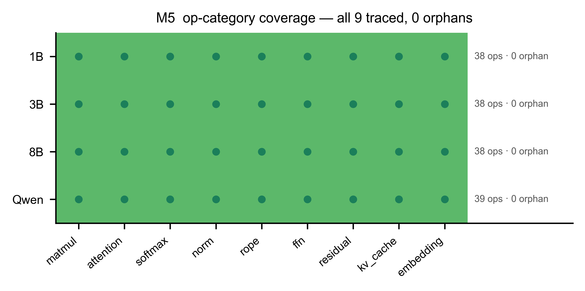

# A6 — M5：工作負載 / trace 產生器（一切的源頭）

> **這一章你會學到**：前面 A1–A5 都在算「某個 op 要多久」，但**「一個 token 到底會跑哪些 op」是誰決定的？** 答案就是 M5。它跟前面元件不一樣——它**沒有要預測的延遲、也沒有要擬合的參數**，所以它的「驗證」是另一種：**結構一致性**（確認它列出的 op 不多不少，剛好等於模型真正會跑的）。

---

## A6.1 架構考量：M5 是誰？為什麼它是「源頭」？

回顧 §0.7 的架構，M5 是最前面的「**① 工作負載產生器**」。它的工作：**把一個 HuggingFace 模型 + 一段輸入長度，轉成「每個 token 會執行的 op 清單（含張量形狀）」**。

這份清單是**整條 pipeline 的輸入**：

- M6 排程器拿它決定每個 op 丟給哪個單元；
- M1/M4 拿每個 op 的形狀去算延遲；
- 最後加總成端到端的 tok/s（Part B）。

所以**如果 M5 列錯了 op，後面全錯**。它的正確性是地基。

---

## A6.2 原理：怎麼「不跑模型」就知道會跑哪些 op？

關鍵洞見（§0.1 的「Phase 0.1」做的）：**一個 LLM 每個 token 會跑哪些 op、形狀多大，是由模型架構 + 輸入長度「決定（deterministic）」的，跟你用什麼硬體、甚至跟權重的數值都無關。**

所以我們用一個 **PyTorch runtime tracer**（搭配 **meta / FakeTensor**——一種「只有形狀、沒有真實數值」的假張量）去**追蹤一次 prefill + 幾個 decode step**：

- 形狀會一路傳播（matmul 的輸出形狀由輸入形狀算出），
- 但**不需要載入真實權重、不需要 GPU、不需要上板**——因為我們只關心「有哪些 op、形狀多少」，不關心算出什麼數值。

追蹤的結果就是 Phase 0.1 的產物：每個模型的 **op inventory**（distinct op 種類 + 形狀分佈 + prefill/decode 標記）。M5 在 Phase 1 直接**重用**這份東西。

---

## A6.3 「參數設計」：M5 沒有參數

這一節很短，因為**M5 是 deterministic 的，沒有任何要擬合的參數**。給定 (模型，長度），它的輸出是唯一確定的。

這帶來一個問題：**沒有延遲可預測、沒有參數可擬合，那要怎麼「驗證」它？** 答案見下節——改驗「結構一致性」。

---

## A6.4 Measurement vs Prediction：用「oracle」交叉檢查

M5 的驗證不是「量測 vs 預測延遲」，而是**「兩種獨立方法數出來的 op 要一致」**。我們有兩個獨立來源：

1. **runtime tracer**（實際追蹤模型跑一遍，列出 op）。
2. **架構解析式 oracle**（`expected_ops_check`）：純粹照 Transformer 架構「**每層該有哪些 op × L 層**」算出來的應有清單。

**如果這兩個獨立方法吻合，代表 trace 是對的**（既沒漏、也沒多）。我們檢查兩件事：

- **語意覆蓋（semantic covered）**：oracle 列的每一種語意 op（**8 種**：matmul、attention、softmax、RMSNorm、RoPE、SwiGLU、residual、embedding）都有被 trace 到 → **四個模型全部 `covered = true`**。（注意：下面圖 A6-1 顯示的是 **9 類**，那是 op_profile 的分法——就是這 8 種語意，再加上 `kv_cache` 這個「記憶體記帳」類；§0.3 也提過 `ffn` 這一類在 profile 裡指 SwiGLU。）
- **0 orphan（零孤兒）**：反過來，**op_profile 裡出現的每一個 op，都必須是 tracer 真的產生過的**（不能憑空多出一個沒被追蹤到的 op）。我們掃過四個模型的每一筆 profile：

| 模型 | distinct op 種類 | profile 列數 | orphan（孤兒）| 語意覆蓋 |
|---|---|---|---|---|
| 1B | 38 | 3267 | **0** | ✅ |
| 3B | 38 | 3267 | **0** | ✅ |
| 8B | 38 | 3267 | **0** | ✅ |
| Qwen | 39 | 3431 | **0** | ✅ |

**0 個孤兒、全部語意覆蓋** → M5 通過。（「profile 列數」是每個模型 **4 個任務**（ShareGPT / GSM8K / HumanEval / LongBench）的 profile 合計，所以才有三千多列。）

> **一個重要的紀律**：count（每個 op 跑幾次）一律取自 inventory，**絕不自己手動 ×layers 推算**。為什麼？因為「手動乘層數」很容易出錯（GQA 的 q≡o、gate≡up 共形、tied embedding 等特例），所以我們讓 tracer/oracle 自己處理，人不插手算。

---

## A6.5 圖片解釋

**圖 A6-1（M5 coverage）— op-category 覆蓋格**

- **每一列 = 一個模型**（1B/3B/8B/Qwen）。**每一行 = 一種 op category**（9 大類）。
- **每一格**：綠色 ✓ = 該模型有 trace 到這一類 op。
- **怎麼看**：整張格子**全綠（4×9 全部 ✓）**（圖中最後一列標 `7b` 即 Qwen-2.5-7B），標題寫「**0 orphans**」——代表每個模型都涵蓋全部 9 類 op，而且沒有任何一個 profile op 是「沒被追蹤到的孤兒」。這就是 M5 的「結構一致性」驗證：**不多、不少、剛剛好**。

---

## A6.6 限制與 gap（誠實清單）

| 項目 | 狀態 | 說明 |
|---|---|---|
| trace 正確性 | ✅ 已驗證 | 0 orphan + 語意覆蓋 + count 取自 inventory（不手動 ×L） |
| 「meas vs pred」形式 | ℹ️ 不同 | M5 無延遲可比；驗的是**結構一致性**（兩種數法吻合） |
| 來源 | ♻️ 重用 Phase 0.1 | M5 前半段就是 Phase 0.1 的 runtime tracer 產物 |
| ONNX 匯出 | ⚠️ 次要路徑 | 給 ONNXim NPU 用的 ONNX 是次要產物、有 fallback;主路徑用 runtime tracer（不靠 ONNX） |

**一句話總結 A6**：M5 是整條 pipeline 的源頭，它用「不載權重的形狀追蹤」決定每個 token 會跑哪些 op;因為它 deterministic、沒有參數，所以驗的不是延遲而是**結構一致性**——用架構 oracle 交叉檢查，四個模型 0 孤兒、9 類全覆蓋，且 count 絕不手動 ×層數。到這裡 Part A 把「可量測校準」的元件（M1/M2/M4/M5/M7）都走完了；A7 補上能耗，A8 講「為什麼 M3/M6 這兩個整合層只定合約」。
