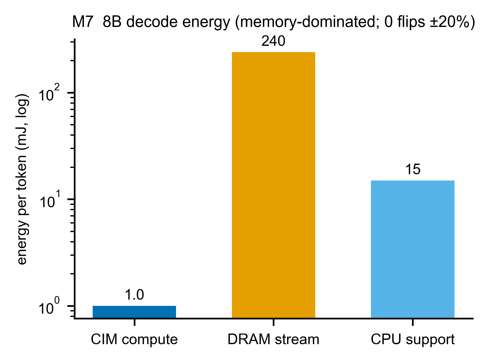

# A7 — M7：能耗估算（沒有電表，怎麼談省電？）

> **這一章你會學到**：為什麼這個專案**量不到真實功耗**、那我們怎麼還能談能耗、以及一個強力支持 CIM-centric 主張的結果——**decode 的能量幾乎全花在「搬權重」，CIM 的「算」便宜到可以忽略**。而且這個結論禁得起參數 ±20% 的搖晃。

---

## A7.1 架構考量：M7 是誰？為什麼它最特別？

M7 是「**⑤ 能耗估算**」（§0.7）。前面 M1/M2/M4 算「**多快**」，M7 算「**多耗電**」（每個 token 花多少焦耳）。

但 M7 有一個**獨特的困難**：**兩塊板子都沒有可用的功耗量測**。
- Aetina Metis Alpha：只有廠商的 TDP 估計，沒有逐 op 的功耗。
- 量產 Metis Card：是 PCIe Rev1 測試板，**沒有功耗 telemetry**。

所以**我們根本量不到真實能耗**。這跟前面所有元件不一樣——M1 有量測可比，M7 沒有。這就逼出一個誠實的問題：**沒有電表，怎麼談省電？**

---

## A7.2 原理：用「規格」估算，不用「量測」

既然量不到，我們改用**規格（spec）估算**（這是 ADR-0005 定的策略）：每個單元的能量 = 它的「活動量」× 它的「能效規格」。

```
CIM 計算能量  = 運算數 ÷ (15 TOPS/W)            ← 廠商 Metis INT8 能效
DRAM 搬移能量 = bits × 4 pJ/bit                  ← JEDEC LPDDR5 每 bit 存取
PCIe 搬移能量 = bits × 5 pJ/bit                  ← PCIe 規格
CPU 計算能量  = 0.75 W/核 × 4 核 × 活動時間        ← ARM A76 datasheet
```

兩個關鍵單位（給初學者）：
- **TOPS/W**（tera-ops per watt）：每瓦能做幾兆次運算 = 每焦耳能做幾兆次運算。15 TOPS/W 代表「1 焦耳能做 15 兆次運算」→ 運算越多越耗能，但 CIM 很省。
- **pJ/bit**（picojoule per bit）：搬 1 個 bit 要花幾皮焦耳。LPDDR5 約 4 pJ/bit、PCIe 約 5 pJ/bit。

> **這些常數是規格/假設，已標註來源**：15 TOPS/W 是 Metis 廠商值；4、5 pJ/bit 是 JEDEC/PCIe 規格的代表值（假設值，明標）；0.75 W/核 是 A76 datasheet。我們不假裝這些是量出來的。

---

## A7.3 參數設計

公式很直接（見上），參數就是那 5 個規格常數。把它們套到 **8B 模型一個 decode token** 的活動上：

- **CIM 計算**：一個 token 要做的乘加 ≈ 權重參數量（GEMV 每個權重做一次乘加）≈ 7.5×10⁹ → 運算數 = 2× ≈ 1.5×10¹⁰ → `÷ 15e12` = **1.0 mJ**。
- **DRAM 搬移**：要串 7.5 GB 權重 = 6×10¹⁰ bits × 4 pJ = **240 mJ**。
- **CPU 支援**：所有輔助 op（A4 的 rmsnorm/rope/swiglu/softmax/sampling × 層數）的活動時間 × 功率 ≈ **15 mJ**。

---

## A7.4 「Measurement vs Prediction」：沒有量測，改驗「穩健性」

這是 M7 最誠實的地方：**沒有真實能耗可比，所以沒有傳統的量測 vs 預測**。那要怎麼相信這個估算？我們改用**三道穩健性檢查**：

1. **Sanity（合理性）**：能量為正、隨活動量單調增加。✅
2. **獨立量級檢查**：把估出的每 token 總能量（256 mJ）÷ 量到的 decode 時間（8B ≈ 1/2.70 = 0.37 s）→ 推得**平均功耗約 0.69 W**。這對一顆行動 SoC 是**合理**的（落在 0.1–20 W），所以量級沒錯得離譜。（注意：這用到了「量測到的 decode 速度」當獨立參照，不是自己對自己。）
3. **±20% 敏感度（最重要）**：把那 5 個規格常數各自 ±20%（16 種組合都試），**檢查「結論會不會翻盤」**。我們關心的定性結論是「**decode 的能量由記憶體主導**」——結果 **16 種組合全部成立、0 次翻盤**。也就是說，就算我們的 pJ/bit、TOPS/W 都抓錯 20%，「memory 主導」這個結論依然站得住。

**核心結果（也是 CIM-centric 的有力證據）**：

| 8B decode 每 token | 能量 | 佔比 |
|---|---|---|
| CIM 計算（算 matmul） | **1.0 mJ** | 0.4% |
| DRAM 搬移（串權重） | **240 mJ** | **94%** |
| CPU 支援 | 15 mJ | 6% |

**CIM 的「算」只花 1 mJ，搬權重花 240 mJ——差 240 倍！** 這正是「memory wall（記憶體牆）」的能量版本，也精準呼應 §0.4 的 CIM-centric 主張：**CIM 計算又快又省，瓶頸（時間和能量）都在搬資料**。系統該繞著「減少搬移」設計，而不是「加速計算」。

> **為什麼分解裡看不到 PCIe？** A7.2 的公式列了 PCIe（5 pJ/bit），但 8B decode 的三根長條沒有它——因為這裡的「搬權重」是從 **on-package DRAM 串流**，不走 PCIe（正是 A2 講的 floor 適用邊界：decode 串流不過 PCIe）。PCIe 能量只在「離散 host↔device 搬移」時才出現，那是 Phase 2 整合時的事。

---

## A7.5 圖片解釋

**圖 A7-1（M7 energy）— 8B decode 每 token 能量分解**

- **X 軸**：三個來源（CIM 計算 / DRAM 搬移 / CPU 支援）。**Y 軸**：每 token 能量（mJ，**對數軸**）。
- **怎麼看**：用對數軸是因為差距太大——DRAM（240）的長條比 CIM（1.0）高出**兩個數量級**。一眼就看出「能量幾乎全在搬資料」。標題註明「memory-dominated；0 flips ±20%」提醒這個結論對參數抖動穩健。

---

## A7.6 限制與 gap（誠實清單）

| 項目 | 狀態 | 說明 |
|---|---|---|
| 能耗本身 | ⚠️ 估算非量測 | 兩板皆無功耗 telemetry（ADR-0005）；用規格估算 |
| 結論可信度 | ✅ 穩健 | 「memory 主導」對所有規格常數 ±20% 不翻盤（16/16） |
| 規格常數 | 📝 假設 | 15 TOPS/W、4/5 pJ/bit、0.75 W/核——規格/假設值，明標來源 |
| CPU 支援時間 | ⚠️ 粗估 | 每 token 的 A76 活動時間是粗略估計 |

> **方法學定位**：最接近的競品 HPIM **完全不報能耗**；CENT/PAPI 用 datasheet 估算。所以一個「透明標註 + 帶 ±20% 敏感度」的規格模型，是符合（甚至優於）領域慣例的。

**一句話總結 A7**:因為兩板都沒電表,M7 用規格估算而非量測,所以驗的不是準確度而是**穩健性**(±20% 不翻盤);最重要的發現是 decode 能量 94% 花在搬權重、CIM 計算只佔 0.4%——這是 CIM-centric「瓶頸在記憶體」主張的能量證據。Part A 到此把所有「可量測校準」的元件走完;最後 A8 解釋為什麼 M3、M6 這兩個整合層在 Phase 1 只定合約、不實作。
