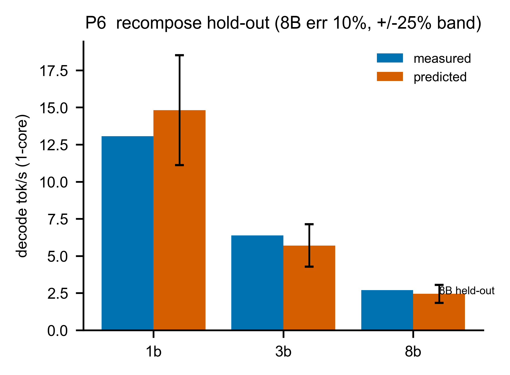
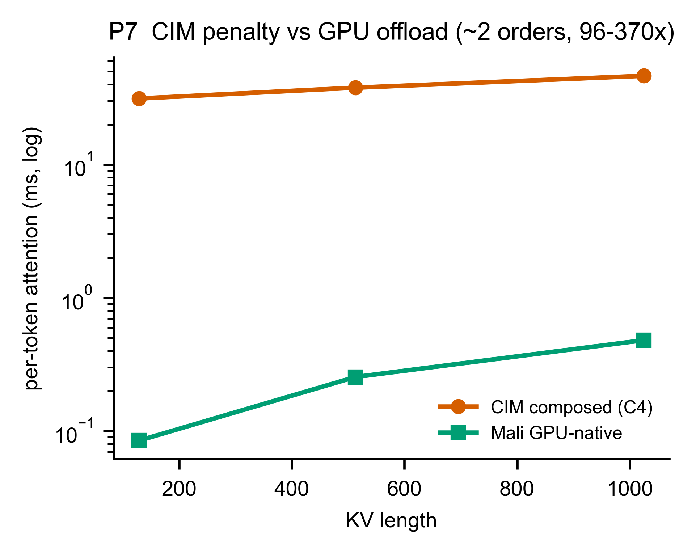

# Part B — 把零件組起來：預測一個真實 LLM 的 decode 速度

> **這一章你會學到**：Part A 把每個零件（M1–M7）各自校準好了；Part B 是**驗收的時刻**——把它們組起來，去預測一個**真實 LLM** 跑得多快（tok/s），再跟量產 Metis Card 的實測比。這是整個 Phase 1 唯一的「端到端」考試，也是「零件對 → 整機對」的關鍵一步。

---

## B.1 為什麼需要這一步？（零件對不代表整機對）

Part A 證明了每個零件準（M1 的 CIM 吞吐 2.7%、M4-GPU 的 attention 0.6%…）。但**零件準 ≠ 組起來準**——組合時可能漏項、可能重複計算、可能拓樸假設錯。所以我們要做一個**端到端的重新合成（recompose）**：用校好的公式 + Phase 0.2 的 op 次數，去預測一個真實 LLM 的 **decode 速度（tok/s）**，再跟真晶片比。

這也呼應 §0.8 的兩種門檻：這裡用的是**較寬鬆的端到端門檻 ≤ 25%**（因為疊了很多元件 + 拓樸假設）。

---

## B.2 decode 速度怎麼預測？（一條極簡的公式）

回顧 §0.3 + A2 + A7 的核心事實：**decode 是 memory-bound，瓶頸是「把權重從記憶體串出來」**。所以：

```
decode 速度（tok/s） = 有效記憶體頻寬  ÷  每個 token 要串的權重位元組
tok_s               = BW_eff          ÷  weight_bytes
```

就這麼簡單。一個 8B 模型每 token 要串 7.5 GB（A7 算過），所以它一定比 1B（1.24 GB）慢——因為要搬的權重多 6 倍。

> **weight_bytes 怎麼來的？** 由 **Phase 0.2 的 op_profile 逐 op 累加** decode 階段的 matmul 位元組得到（這是 Phase 1 對舊方法的精化）。算出來：1B = 1.24 GB、3B = 3.21 GB、8B = 7.51 GB——和理論值吻合到 0.1%。

---

## B.3 Measurement vs Prediction：8B 的「保留考試」

這是 Phase 1 最重要的一個驗證，而且我們刻意讓它**非循環**（§0.5 的 held-out）:

1. **只用 1B 和 3B** 的實測 tok/s,反推出有效頻寬 `BW_eff`。算出 **BW_eff = 18.33 GB/s**。
2. **完全不看 8B**，直接用這個 BW 去預測 8B:`pred_8B = 18.33 GB/s ÷ 7.51 GB = 2.44 tok/s`。
3. **再跟 8B 的實測比**：實測 **2.70 tok/s** → 誤差 **9.5%**，**遠在 25% 門檻內**。✅

**為什麼這很有力?** 因為 8B 是「考題」——它的答案完全沒參與擬合。模型在「沒看過的模型大小」上預測準，代表它**真的抓到了 memory-wall 的規律**，不是硬湊。

**圖 B-1（P6）— 端到端 recompose 量測 vs 預測**


- **X 軸**：模型（1B / 3B / 8B）。**Y 軸**：decode 速度（tok/s，1 核）。
- **藍 = 實測，橘 = 預測**，橘色有 **±25% 誤差帶**。
- **怎麼看**：1B/3B 是「拿來擬合 BW」的點（所以橘藍接近）；**8B 是 held-out 考題**，橘色預測（2.44）落在實測（2.70）的 ±25% 帶內 → 通過。

> **一個有趣的細節（size 趨勢）**：各模型反推的有效頻寬是 **16.2 / 20.5 / 20.3 GB/s**(1B/3B/8B）。可以看到**小模型的有效頻寬較低**（串權重較沒效率）——這是真實的 size 依賴，也正是為什麼我們用 1B+3B→8B 的 hold-out 而不是自己對自己。

---

## B.4 拓樸的誠實：為什麼 Alpha 的 911µs floor 不進這個預測

A2 講過 Alpha 板每次 decode 都付 911µs 的 PCIe floor。但**這個預測裡故意不放它**，為什麼?

因為我們預測的對象是**量產 Metis Card**（有 on-card DRAM）,decode 串流權重時權重就在卡上、不走 PCIe → 不付那筆 floor。Alpha 的 911µs 是**該板沒有 on-card DRAM 的拓樸限制**，findings 明禁把它外推到量產卡。這就是 §0.4 講的「橋接假設」：CIM 計算 timing 不變，只有資料搬移 timing 隨拓樸改變。

---

## B.5 為什麼 attention 一定要 offload?（C4 的量化證據）

A3 說「CIM 不擅長 attention,要丟給 GPU」。Part B 給出**量化證據**。我們組合出「如果硬要 CIM 做 attention」的成本（C4):每個 decode step,CIM 得把長大的 KV-cache **重新載入** crossbar,成本是：

```
CIM attention ≈ 每層(KV 重載 bytes ÷ 頻寬 + 固定 floor) × 層數  ≈  31–46 ms/token
```

對比 GPU 原生 attention(A3):**幾十到幾百 µs**。**差約 2 個數量級（96–370 倍)!**

**圖 B-2（P7）— CIM attention penalty vs GPU offload**


- **X 軸**：KV 長度。**Y 軸**：每 token 的 attention 延遲（ms，**對數軸**）。
- **橘 = CIM composed（含 KV 重載）、綠 = Mali GPU 原生**。
- **怎麼看**：對數軸下兩條線差了約 2 格（兩個數量級，96–370×）。把 attention 留在 CIM 會讓每個 token 多付 31–46 ms 的 KV 重載 penalty，相對 decode 主幹（幾百 ms）是一筆**可觀（約 8–12%）、但短上下文下還不致翻盤 gate** 的額外負擔（長上下文下會更糟，因為 KV 重載隨上下文成長）。

> **注意這張圖的「比較單位」**：橘線（CIM）是**整個 token、所有層**的 composed penalty（主要是 KV 重載）,綠線（GPU）是**單一 head 的原生計算**——所以這是一個「**為什麼要 offload**」的**示意對照**，不是嚴格的同單位 head-to-head。它要傳達的**結構性事實**才是重點：**CIM 每個 decode step 都得把長大的 KV 重載進 crossbar（一筆隨上下文成長的頻寬 penalty）,而 GPU/NPU 原生做 attention 不需要這個重載**。這個結構差異不因 kernel 好壞而消失，所以「offload」結論穩固。另外這個 C4 值是 **Alpha 拓樸的上界估計**，且**不放進 B.3 的 decode 預測**(那裡 attention 走 GPU-offload）。

---

## B.6 那些「沒進主預測」的項（誠實揭露)

B.3 的 decode 預測**只用了 weight-streaming 主幹**(`BW_eff/weight_bytes`）。但一個 token 其實還有別的成本：CPU 支援 op、GPU-offload 的 attention、kv_cache append。為什麼沒加進去?

因為 **`BW_eff` 是從實測 tok/s 反推的，它已經「吸收」了這些成本**（實測時間本來就包含它們）。如果再把它們**額外加上去，就會重複計算（double-count）**。所以我們把這些項**單獨列出來當透明參考，但不加進主預測**：

| 8B decode 每 token（單獨列，未加總） | 時間 |
|---|---|
| decode 串流主幹 | ~409 ms |
| CPU 支援 op | ~62 ms |
| GPU-offload attention（未優化 kernel × heads × layers） | ~260 ms |
| kv_cache append | ~1.4 ms |

> ⚠️ **別把這裡的 260 ms 跟 B.5 的 CIM 31–46 ms 直接比、誤以為「CIM 比較快」**——兩個是不同的量，而且這個 260 ms 是個**寬鬆的上界**：它是 A3 那顆**未優化 GPU kernel** 的單-head 成本再 ×(heads × layers) 堆出來的（heads×layers 的聚合方式本身還是 Phase-2 的 watch-item）。一顆調教過的 Mali kernel 會遠低於此。（補充：recompose 的 JSON 欄位把它叫 `lower_bound`，指的是**吞吐的下界**——吞吐下界等價於**延遲的上界**，跟這裡講「260 ms 是寬鬆上界」是同一回事。）B.5 的「該 offload」結論靠的是**結構性論證**（CIM 有「KV 每步重載」的頻寬 penalty,GPU/NPU 原生做 attention 沒有這個 penalty）,不是這個被 kernel 品質灌水的絕對值。
>
> 另外這也是記在案的 **Phase-2 watch-item**：這些項**沒有加進 B.3 的主預測**，因為 `BW_eff` 是從實測反推、已經吸收了它們，再加就重複計算；短上下文下它們小、不影響 8B 的 gate,但長上下文（LongBench）下 kv_cache 會變大，Phase 2 要決定它是「加性項」還是「已含在頻寬裡」。

---

## B.7 prefill:誠實標為「未驗證」

整個 Part B 講的都是 **decode**。**prefill（預填）我們明確標為未驗證**，原因（A1/A4 都提過）:

- CIM 的 prefill 投影（M≥512）在裝置上**配置失敗，沒量到**。
- prefill 的 attention、softmax 是 S×S 形狀，本期沒涵蓋。

我們有量產卡的 prefill 時間錨點（`ttft_s_median`,8B = 3.79 s）。用它反推，**prefill 的 GEMM 吞吐約 4.1 TOPS**——但如果錯用 decode 的吞吐（204 GOP/s）去估，會得到荒謬的 75 秒。這個 20 倍的差距正好證明：**prefill 的吞吐和 decode 完全不同，而我們沒量到它**。所以 prefill 預測是 **best-effort、不評分、列為 Phase 2 必補**。

（順帶：vendor 還有一個 `prefill_ms_median` 欄位，但它跨模型都是 ~0.007 s 不變，是個壞掉的 degenerate 欄位，我們棄用、改用會隨模型變的 `ttft_s_median`。）

---

## B.8 Part B 總結

| 項目 | 結果 |
|---|---|
| **decode 端到端（唯一硬 gate)** | ✅ 8B held-out **2.44 vs 2.70 = 9.5%**(≤25%) |
| weight_bytes 來源 | op_profile 逐 op 累加，對理論值 0.1% |
| size 趨勢 | 有效頻寬 16.2/20.5/20.3 GB/s（小模型較低） |
| attention offload 證據 | CIM 31–46ms vs GPU 幾百µs,差 2 個數量級 |
| 非串流項 | 單獨列、未加總（避免 double-count,Phase-2 watch-item) |
| **prefill** | ❌ 未驗證（裝置配置失敗；best-effort、不評分) |

**一句話總結 Part B**：把 Part A 的零件組起來，用「頻寬 ÷ 權重位元組」這條極簡公式，在**沒看過的 8B 模型**上預測 decode 速度，誤差 **9.5%**——證明「零件對 → 整機對」；同時量化證明 attention 該 offload(差 2 個數量級）、誠實揭露 prefill 未驗證與 double-count 的 Phase-2 待辦。**這就是 Phase 1 的終點：一組校準好、誠實標註、可外推的 component 模型，交給 Phase 2 組成完整模擬器。**
